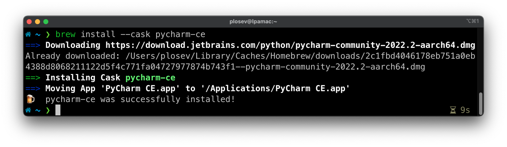
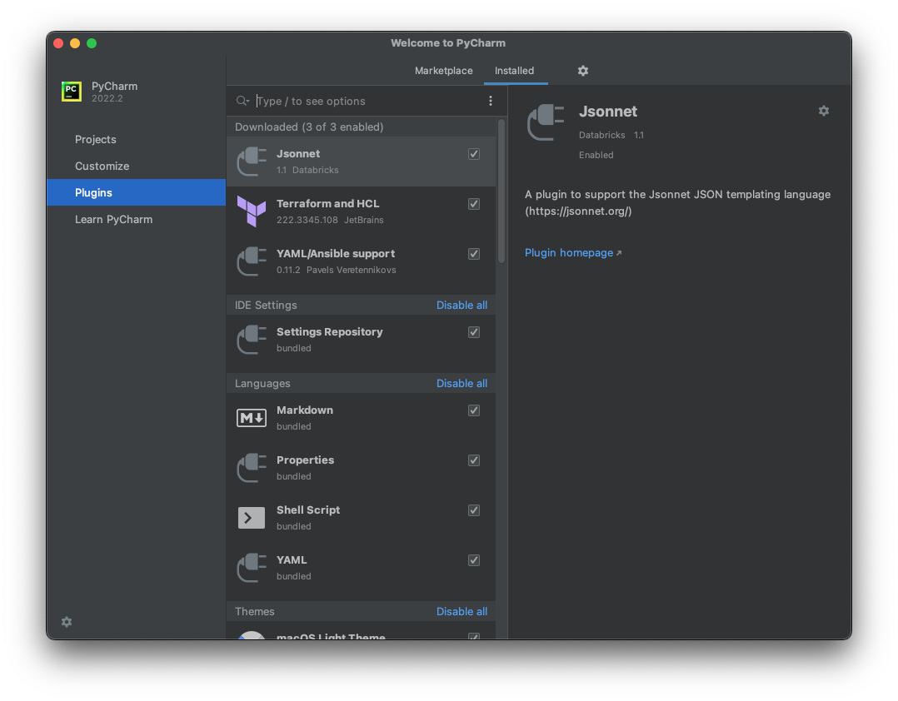
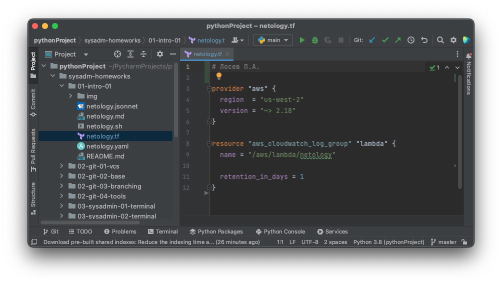
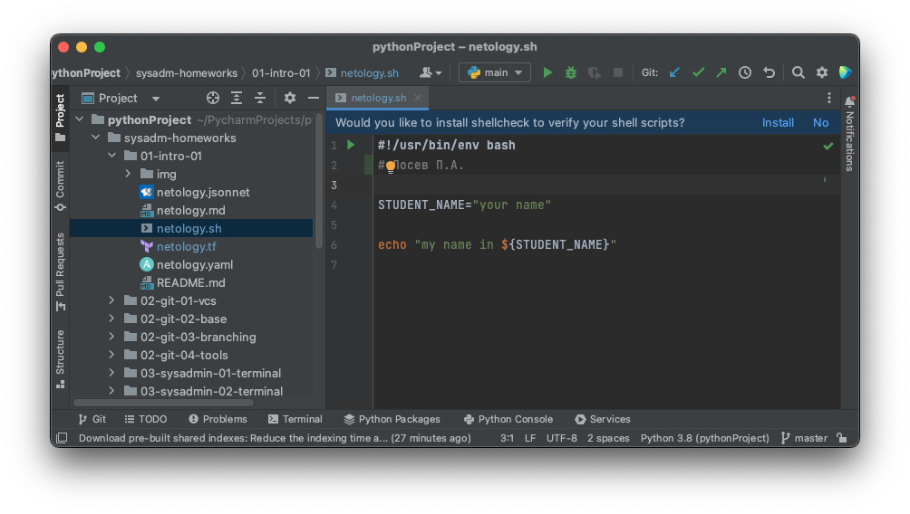
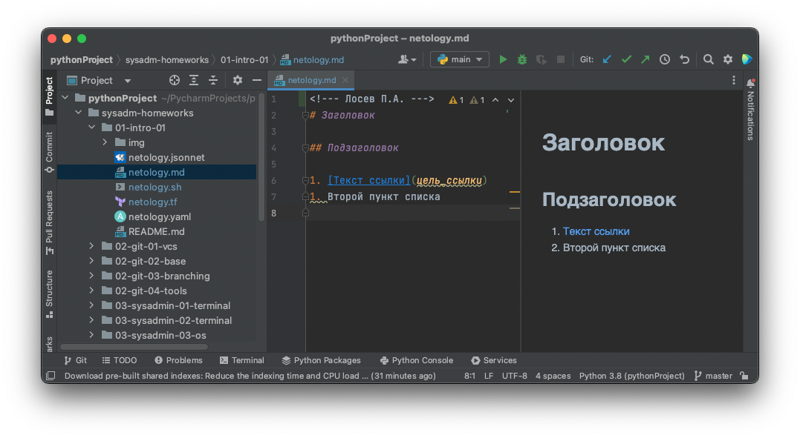
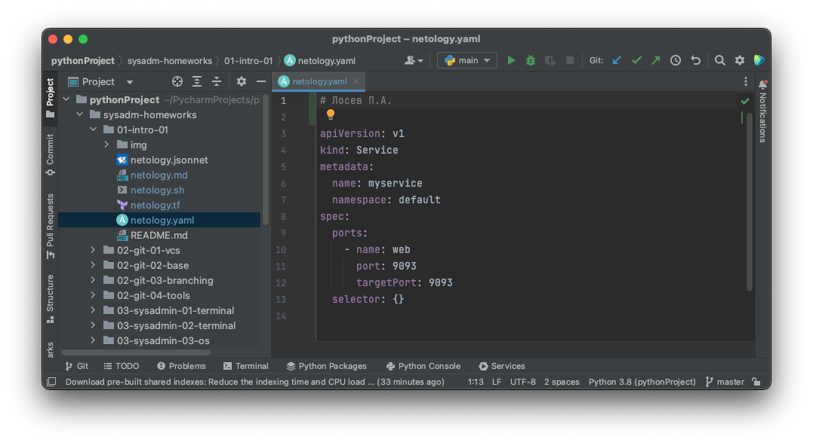
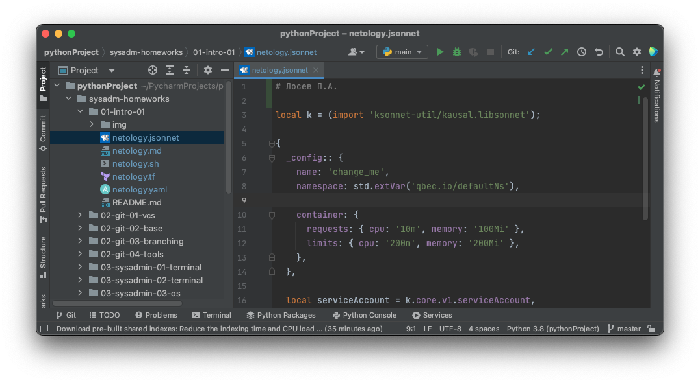

## Задание №1 - Подготовка рабочей среды

1. Установить PyCharm Community Edition: https://www.jetbrains.com/ru-ru/pycharm/download/. 
Если у вас уже установлен любой другой продукт от JetBrains,то можно использовать его. 
1. Установить плагины:
    - Terraform,
    - MarkDown,
    - Yaml/Ansible Support,
    - Jsonnet.
1. Склонировать текущий репозиторий или просто создать файлы для проверки плагинов:
    - netology.tf – terraform,
    - netology.sh – bash,
    - netology.md – markdown, 
    - netology.yaml – yaml,
    - netology.jsonnet – jsonnet.
1. Убедитесь, что работает подсветка синтаксиса.
1. Добавьте свое имя в каждый файл, сделайте снимок экрана и загрузите его на любой сервис обмена картинками.
1. Ссылки на картинки укажите в личном кабинете как решение домашнего задания. 

## Решение

1. Установка PyCharm Community Edition была произведена на macOS с помощью homebrew:

2. Установлены требуемые плагины:

3. Клонирование репозитория командой из терминала:

   git clone https://github.com/netology-code/sysadm-homeworks.git

4. Скриншоты с подсветкой синтаксиса:
- Terraform: 
- Bash: 
- Markdown: 
- yaml: 
- jsonnet: 

5. На всех скриншотах предыдущего пункта в файлы добавлены ФИО.
6. Скриншоты загружены на этот же github репозиторий.

## Задание №2 - Описание жизненного цикла задачи (разработки нового функционала)

Чтобы лучше понимать предназначение дальнейших инструментов, с которыми нам предстоит работать, давайте 
составим схему жизненного цикла задачи в идеальном для вас случае.

### Описание

Представьте, что вы работаете в стартапе, который запустил интернет-магазин. Ваш интернет-магазин достаточно успешно развивался, и вот пришло время налаживать процессы: у вас стало больше конечных клиентов, менеджеров и разработчиков.Сейчас от клиентов вам приходят задачи, связанные с разработкой нового функционала. Задач много, и все они требуют выкладки на тестовые среды, одобрения тестировщика, проверки менеджером перед показом клиенту. В случае необходимости, вам будет необходим откат изменений. 

Вам необходимо описать процесс решения задачи в соответствии с жизненным циклом разработки программного обеспечения. Использование какого-либо конкретного метода разработки не обязательно. Для решения главное - прописать по пунктам шаги решения задачи (релизации в конечный результат) с участием менеджера, разработчика (или команды разработчиков), тестировщика (или команды тестировщиков) и себя как DevOps-инженера.

## Решение

1. Заказчик передает новую задачу менеджерам.
2. Менеджеры согласуют задачу с разработчиками для оценки сроков и возможности реализации.
3. При возможности реализации задачи, менеджеры согласуют условия ее реализации с заказчиком.
4. Менеджеры планируют задачу в соответствии с условиями и приоритета данной задачи.
5. Разработчики приступают к реализации запланированной задачи.
6. Разработчики производят совещания ежедневные и еженедельные для обсуждения хода решения задач.
7. Разработчики пишут тесты (юнит, функциональные, приемочные).
8. Разработчики делают код-ревью своих коллег.
9. DevOps-инженер обеспечивает работу систему, при которой только код прошедший автоматизированное тестирование и полностью покрытый тестами попадает в основную ветку.
10. DevOps-инженер проверяет новый код на безопасность.
11. DevOps-инженер обеспечивает выкладку продукта в Staging среду идентичную Production.
12. Тестировщики производят тесты для проверки всей функциональности.
13. Тестировщики производят тесты для проверки новой функциональности.
14. DevOps-инженер и/или системные администраторы контролируют работу с помощью систем мониторинга и анализа логов.
15. Менеджеры производят проверку готового функционала.
16. Менеджеры производят показ нового функционала заказчику.
17. После одобрения заказчика новая версия вливается в Production.
18. Оказывается дальнейшая поддержка всеми сотрудниками для решения возникающих проблем (багов) или на случай технических неисправностей или аварий.