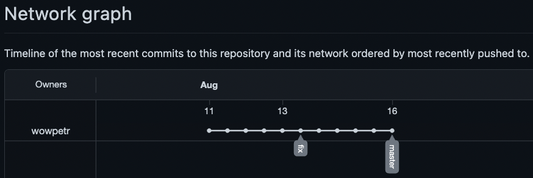

## Задание №1 – Знакомимся с gitlab и bitbucket 

Иногда при работе с git-репозиториями надо настроить свой локальный репозиторий так, чтобы можно было 
отправлять и принимать изменения из нескольких удалённых репозиториев. 
Это может понадобиться при работе над проектом с открытым исходным кодом, если автор проекта не дает права 
на запись в основной репозиторий. Либо некоторые распределенные команды используют такой принцип работы, когда
каждый разработчик имеет свой репозиторий, а в основной репозиторий пушатся только конечные результаты 
работы над задачами. 

Так же у DevOps-специалиста должен быть хороший кругозор, поэтому давайте познакомимся с gitlab и bitbucket.

Создадим аккаунт в gitlab, если у вас его еще нет:
1. Gitlab. Страница регистрации https://gitlab.com/users/sign_up, для регистрации можно использовать 
аккаунт google, github и другие. 
1. После регистрации или авторизации в gitlab создайте новый проект, нажав на ссылку `Create a projet`. 
Желательно назвать также, как и в гитхабе `devops-netology` и `visibility level` выбрать `Public`.
1. Галочку `Initialize repository with a README` луше не ставить, чтобы не пришлось разрешать конфликты.
1. Если вы зарегистрировались при помощи аккаунта в другой системе и не указали пароль, то увидите сообщение
`You won't be able to pull or push project code via HTTPS until you set a password on your account`. 
Тогда перейдите по ссылке из этого сообщения (https://gitlab.com/profile/password/edit) и задайте пароль. 
Если вы уже умеете пользоваться ssh ключами, то воспользуйтесь этой возможностью (подробнее про ssh мы поговорим в следующем учебном блоке).
1. Перейдите на страницу созданного вами репозитория, url будет примерно такой:
https://gitlab.com/YOUR_LOGIN/devops-netology и изучите предлагаемые варианты для начала работы в репозитории в секции
`Command line instructions`. 
1. Запомните вывод команды `git remote -v`.
1. В связи с тем, что это будет наш дополнительный репозиторий, ни один вариант из перечисленных в инструкции (на странице 
вновь созданного репозитория) нам не подходит. Поэтому добавляем этот репозиторий как дополнительный `remote` к созданному
репозиторию в рамках предыдущего домашнего задания:
`git remote add gitlab https://gitlab.com/YOUR_LOGIN/devops-netology.git`.
1. Отправьте изменения в новый удалённый репозиторий `git push -u gitlab main`.
1. Обратите внимание как изменился результат работы команды `git remote -v`.

Теперь необходимо проделать все тоже самое с https://bitbucket.org/. 
1. Обратите внимание, что репозиторий должен быть публичным, то есть отключите галочку `private repository` при создании репозитория.
1. И на вопрос `Include a README?` отвечаем отказом. 
1. В отличии от гитхаба и гитлаба, в битбакете репозиторий должен принадлежать проекту, поэтому во время создания репозитория 
надо создать и проект, который можно назвать, например, `netology`.
1. Аналогично gitlab, на странице вновь созданного проекта выберите `https`, чтобы получить ссылку и добавьте этот репозиторий как 
`git remote add bitbucket ...`.
1. Обратите внимание, как изменился результат работы команды `git remote -v`.

Если все проделано правильно, то результат команды `git remote -v` должен быть следующий:
```bash
$ git remote -v
bitbucket https://andreyborue@bitbucket.org/andreyborue/devops-netology.git (fetch)
bitbucket https://andreyborue@bitbucket.org/andreyborue/devops-netology.git (push)
gitlab	  https://gitlab.com/andrey.borue/devops-netology.git (fetch)
gitlab	  https://gitlab.com/andrey.borue/devops-netology.git (push)
origin	  https://github.com/andrey-borue/devops-netology.git (fetch)
origin	  https://github.com/andrey-borue/devops-netology.git (push)
```

Дополнительно можете так же добавить удалённые репозитории по `ssh`, тогда результат будет примерно такой:
```bash
git remote -v
bitbucket	git@bitbucket.org:andreyborue/devops-netology.git (fetch)
bitbucket	git@bitbucket.org:andreyborue/devops-netology.git (push)
bitbucket-https	https://andreyborue@bitbucket.org/andreyborue/devops-netology.git (fetch)
bitbucket-https	https://andreyborue@bitbucket.org/andreyborue/devops-netology.git (push)
gitlab	git@gitlab.com:andrey.borue/devops-netology.git (fetch)
gitlab	git@gitlab.com:andrey.borue/devops-netology.git (push)
gitlab-https	https://gitlab.com/andrey.borue/devops-netology.git (fetch)
gitlab-https	https://gitlab.com/andrey.borue/devops-netology.git (push)
origin	git@github.com:andrey-borue/devops-netology.git (fetch)
origin	git@github.com:andrey-borue/devops-netology.git (push)
origin-https	https://github.com/andrey-borue/devops-netology.git (fetch)
origin-https	https://github.com/andrey-borue/devops-netology.git (push)
```

Выполните push локальной ветки `main` в новые репозитории. 
Подсказка: `git push -u gitlab main`. На этом этапе история коммитов во всех трех репозиториях должна совпадать. 

## Решение

Создание аккаунта в GitLab
1. Создал новый аккаунт на GitLab. 
2. Создал новый проект с именем `netology-devops-homeworks`.
3. При создании проекта выключил флаг `Initialize repository with a README`.
4. Добавил открытый ключ SSH и задал пароль для доступа по HTTPS.
5. На странице созданного проекта изучил страницу `Command line instructions`.
6. Вывод команды `git remote -v`: 

7. Добавил новый дополнительный репозиторий командой: `git remote add gitlab git@gitlab.com:wowpetr/netology-devops-homeworks.git`.  
8. Отправил данные в созданный репозиторий командой: `git push -u gitlab master`:

9. Вывод команды `git remote -v`:


Создание аккаунта на Bitbucket
1. Создал новый аккаунт и публичный репозиторий на BitBucket.
2. Отключил опцию `Include a README?` при создании аккаунта.
3. Одновременно создал проект `netology` при создании аккаунта.
4. Добавил репозиторий по протоколу HTTPS командой: `git remote add bitbucket-https https://wowpetr@bitbucket.org/wowpetr/netology-devops-homeworks.git`. 
5. Задал публичный ключ SSH в настройках и добавил репозиторий по протоколу SSH командой: `git remote add bitbucket git@bitbucket.org:wowpetr/netology-devops-homeworks.git`:
 и отправил данные в созданный репозиторий командой: `git push -u bitbucket master`:


## Задание №2 – Теги

Представьте ситуацию, когда в коде была обнаружена ошибка - надо вернуться на предыдущую версию кода,
исправить ее и выложить исправленный код в продакшн. Мы никуда код выкладывать не будем, но пометим некоторые коммиты тегами и 
создадим от них ветки. 

1. Создайте легковестный тег `v0.0` на HEAD коммите и запуште его во все три добавленных на предыдущем этапе `upstream`.
1. Аналогично создайте аннотированный тег `v0.1`.
1. Перейдите на страницу просмотра тегов в гитхабе (и в других репозиториях) и посмотрите, чем отличаются созданные теги. 
    * В гитхабе – https://github.com/YOUR_ACCOUNT/devops-netology/releases
    * В гитлабе – https://gitlab.com/YOUR_ACCOUNT/devops-netology/-/tags
    * В битбакете – список тегов расположен в выпадающем меню веток на отдельной вкладке. 

## Решение

1. Создал неаннотированный тег `v0.0` на HEAD коммите командой: `git tag v0.0`.   
Созданный тег отправил во все созданные репозитории командами: `git push origin v0.0`, `git push gitlab v0.0`, `git push bitbucket v0.0`.
2. Создал аннотированный тег `v0.1` на HEAD коммите командой: `git tag -a v0.1`.  
Созданный тег отправил во все созданные репозитории командами: `git push origin v0.1`, `git push gitlab v0.1`, `git push bitbucket v0.1`.
3. Нашел созданные теги в Web-интерфейсе всех трех площадок (GitHub, GitLab, Bitbucket).

## Задание №3 – Ветки 

Давайте посмотрим, как будет выглядеть история коммитов при создании веток. 

1. Переключитесь обратно на ветку `main`, которая должна быть связана с веткой `main` репозитория на `github`.
1. Посмотрите лог коммитов и найдите хеш коммита с названием `Prepare to delete and move`, который был создан в пределах предыдущего домашнего задания. 
1. Выполните `git checkout` по хешу найденного коммита. 
1. Создайте новую ветку `fix` базируясь на этом коммите `git switch -c fix`.
1. Отправьте новую ветку в репозиторий на гитхабе `git push -u origin fix`.
1. Посмотрите, как визуально выглядит ваша схема коммитов: https://github.com/YOUR_ACCOUNT/devops-netology/network. 
1. Теперь измените содержание файла `README.md`, добавив новую строчку.
1. Отправьте изменения в репозиторий и посмотрите, как изменится схема на странице https://github.com/YOUR_ACCOUNT/devops-netology/network 
и как изменится вывод команды `git log`.

## Решение

1. origin->master уже была активной, но переключил трекинг на gitlab командой: `git branch -u origin/master`.
2. Нашел кеш: `1619776` коммита `Prepare to delete and move`:

3. Выполнил `git checkout 1619776` для перехода на данный коммит.
4. Создан новую ветку `fix`, командой: `git switch -c fix`.
5. Отправил созданную ветку на репозиторий github командой: `git push origin fix`:

6. Изменил файл `README.md`, добавив новую строчку: `#### new line`.
7. Отправил изменения в репозиторий командой: `git push origin fix`:


## Задание №4 – Упрощаем себе жизнь

Давайте попробуем поработать с Git при помощи визуального редактора. 

1. В используемой нами IDE Py Charm откройте визуальный редактор работы с git, находящийся в меню View -> Tool Windows -> Git.
1. Измените какой-нибудь файл, и он сразу появится на вкладке `Local Changes`, отсюда можно выполнить коммит нажав на кнопку внизу этого диалога. 
1. Элементы управления для работы с гитом будут выглядеть примерно вот так:
   
1. Попробуйте выполнить пару коммитов используя IDE. 

https://www.jetbrains.com/help/pycharm/commit-and-push-changes.html – здесь можно найти справочную информацию по визуальному интерфейсу. 
И если вверху экрана выбрать свою операционную систему, то можно посмотреть горячие клавиши для работы с гитом. 
Подробней о визуальном интерфейсе будет рассказано на одной из следующих лекций.

В виде результата работы по всем заданиям приложите ссылки на все три ваших репозитория в github, gitlab и bitbucket.  