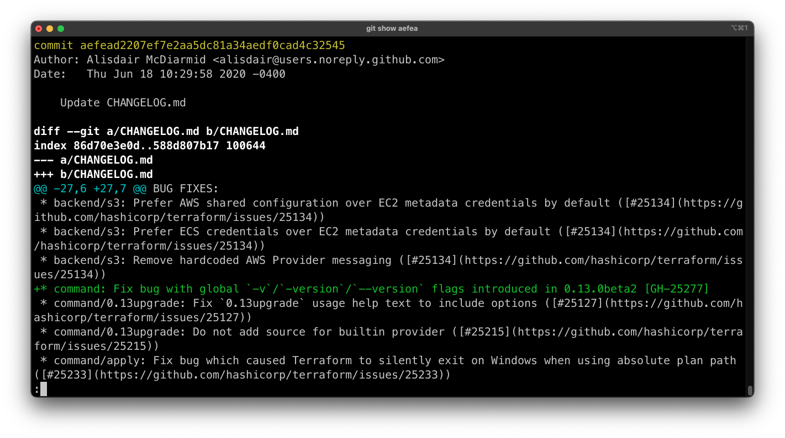
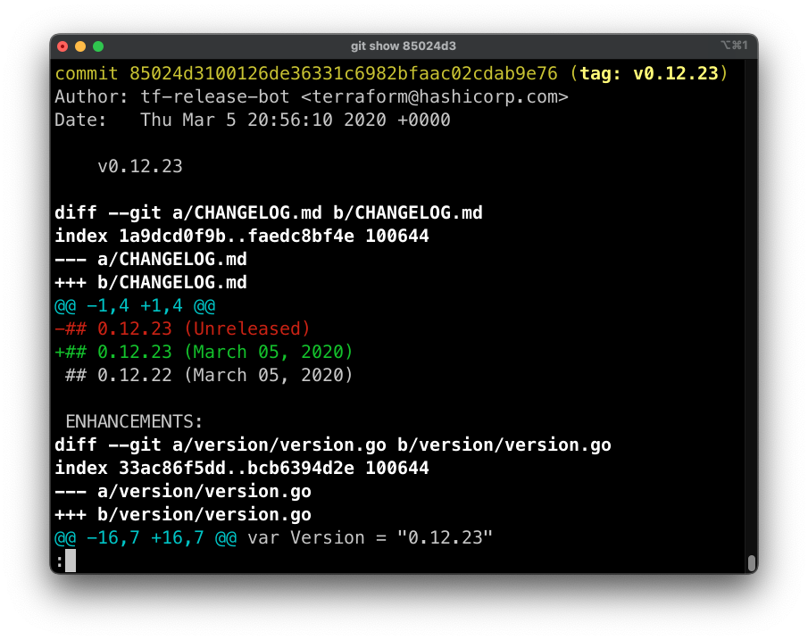
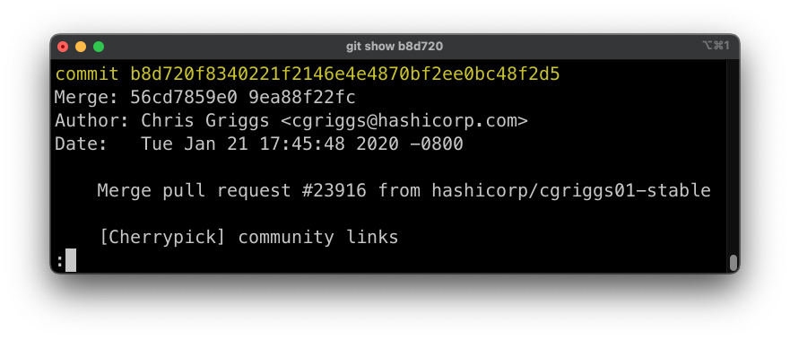
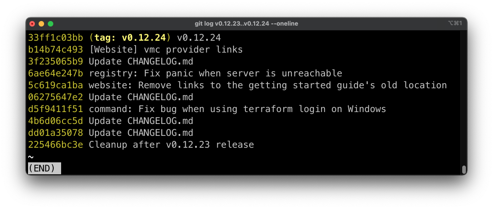
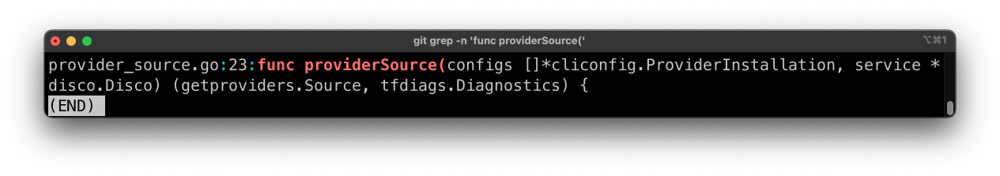
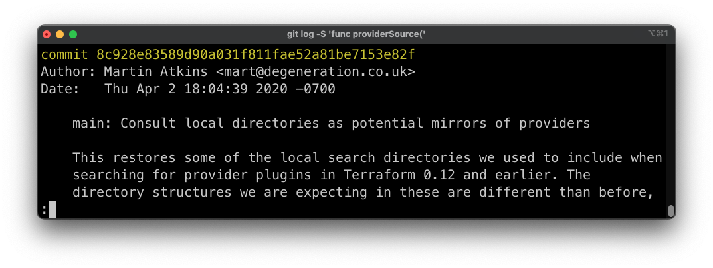
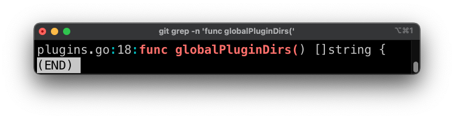
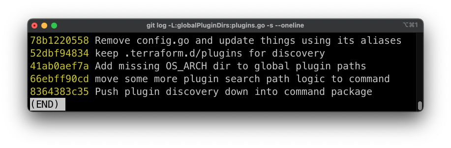

# Домашнее задание к занятию «2.4. Инструменты Git»

Для выполнения заданий в этом разделе давайте склонируем репозиторий с исходным кодом 
терраформа https://github.com/hashicorp/terraform 

В виде результата напишите текстом ответы на вопросы и каким образом эти ответы были получены. 

1. Найдите полный хеш и комментарий коммита, хеш которого начинается на `aefea`.
1. Какому тегу соответствует коммит `85024d3`?
1. Сколько родителей у коммита `b8d720`? Напишите их хеши.
1. Перечислите хеши и комментарии всех коммитов которые были сделаны между тегами  v0.12.23 и v0.12.24.
1. Найдите коммит в котором была создана функция `func providerSource`, ее определение в коде выглядит 
так `func providerSource(...)` (вместо троеточий перечислены аргументы).
1. Найдите все коммиты в которых была изменена функция `globalPluginDirs`.
1. Кто автор функции `synchronizedWriters`? 

## Решение 

1. Искомым хешем коммита начинающегося на `aefea` является `aefead2207ef7e2aa5dc81a34aedf0cad4c32545`, который был определен с помощью команды `git show aefea`:

2. Коммиту `85024d3` соответствует тег `v0.12.23`, который был определен с помощью команды `git show 85024d3`:

3. Коммит `b8d720` имеет двух родителей так как он merge и его короткие хеши: `56cd7859e0` и `9ea88f22fc`, которые выведены командой `git show b8d720`:

Полные хеши можно вывести командами: `git show b8d720^1` и `git show b8d720^2` и они равны: `56cd7859e05c36c06b56d013b55a252d0bb7e158` и `9ea88f22fc6269854151c571162c5bcf958bee2b` соответственно.
4. Между тегами v0.12.23 и v0.12.24 нашел следующие коммиты: `33ff1c03bb`, `b14b74c493`, `3f235065b9`, `6ae64e247b`, `5c619ca1ba`, `06275647e2`, `d5f9411f51`, `4b6d06cc5d`, `dd01a35078`, `225466bc3e`:

Данные коммиты найдены с помощью команды: `git log v0.12.23..v0.12.24 --one-line`.
5. Для поиска коммита, где функция `providerSource` была создана, я сначала определил имя файла командой: `git grep -n 'func providerSource('`:  

Затем найденное имя файла `provider_source.go`, использовал в команде: `git log -L:providerSource:provider_source.go` первый коммит `8c928e83589d90a031f811fae52a81be7153e82f` (конец списка) и является коммитом, где функция впервые была определена.  
Также можно воспользоваться командой: `git log -S 'func providerSource('`:  

6. Для поиска всех коммитов изменений функции `globalPluginDirs` я использовал команду: `git grep -n 'func globalPluginDirs('`:  

Затем найденное имя файла `plugins.go`, использовал в команде: `git log -L:globalPluginDirs:plugins.go -s --oneline` для вывода списка всех коммитов:  

7. Автором функции `synchronizedWriters` является `Martin Atkins` в коммите `5ac311e2a91e381e2f52234668b49ba670aa0fe5`, но эта функция и файл где она была описана уже удалена персоной `James Bardin` в коммите `bdfea50cc85161dea41be0fe3381fd98731ff786`. 
Для поиска использовалась команда `git log -S 'func synchronizedWriters' --oneline`.