# Домашнее задание к занятию "3.1. Работа в терминале, лекция 1"

1. Установите средство виртуализации [Oracle VirtualBox](https://www.virtualbox.org/).

1. Установите средство автоматизации [Hashicorp Vagrant](https://www.vagrantup.com/).

1. В вашем основном окружении подготовьте удобный для дальнейшей работы терминал. Можно предложить:

	* iTerm2 в Mac OS X
	* Windows Terminal в Windows
	* выбрать цветовую схему, размер окна, шрифтов и т.д.
	* почитать о кастомизации PS1/применить при желании.

	Несколько популярных проблем:
	* Добавьте Vagrant в правила исключения перехватывающих трафик для анализа антивирусов, таких как Kaspersky, если у вас возникают связанные с SSL/TLS ошибки,
	* MobaXterm может конфликтовать с Vagrant в Windows,
	* Vagrant плохо работает с директориями с кириллицей (может быть вашей домашней директорией), тогда можно либо изменить [VAGRANT_HOME](https://www.vagrantup.com/docs/other/environmental-variables#vagrant_home), либо создать в системе профиль пользователя с английским именем,
	* VirtualBox конфликтует с Windows Hyper-V и его необходимо [отключить](https://www.vagrantup.com/docs/installation#windows-virtualbox-and-hyper-v),
	* [WSL2](https://docs.microsoft.com/ru-ru/windows/wsl/wsl2-faq#does-wsl-2-use-hyper-v-will-it-be-available-on-windows-10-home) использует Hyper-V, поэтому с ним VirtualBox также несовместим,
	* аппаратная виртуализация (Intel VT-x, AMD-V) должна быть активна в BIOS,
	* в Linux при установке [VirtualBox](https://www.virtualbox.org/wiki/Linux_Downloads) может дополнительно потребоваться пакет `linux-headers-generic` (debian-based) / `kernel-devel` (rhel-based).

1. С помощью базового файла конфигурации запустите Ubuntu 20.04 в VirtualBox посредством Vagrant:

	* Создайте директорию, в которой будут храниться конфигурационные файлы Vagrant. В ней выполните `vagrant init`. Замените содержимое Vagrantfile по умолчанию следующим:

		```bash
		Vagrant.configure("2") do |config|
			config.vm.box = "bento/ubuntu-20.04"
		end
		```

	* Выполнение в этой директории `vagrant up` установит провайдер VirtualBox для Vagrant, скачает необходимый образ и запустит виртуальную машину.

	* `vagrant suspend` выключит виртуальную машину с сохранением ее состояния (т.е., при следующем `vagrant up` будут запущены все процессы внутри, которые работали на момент вызова suspend), `vagrant halt` выключит виртуальную машину штатным образом.

1. Ознакомьтесь с графическим интерфейсом VirtualBox, посмотрите как выглядит виртуальная машина, которую создал для вас Vagrant, какие аппаратные ресурсы ей выделены. Какие ресурсы выделены по-умолчанию?

1. Ознакомьтесь с возможностями конфигурации VirtualBox через Vagrantfile: [документация](https://www.vagrantup.com/docs/providers/virtualbox/configuration.html). Как добавить оперативной памяти или ресурсов процессора виртуальной машине?

1. Команда `vagrant ssh` из директории, в которой содержится Vagrantfile, позволит вам оказаться внутри виртуальной машины без каких-либо дополнительных настроек. Попрактикуйтесь в выполнении обсуждаемых команд в терминале Ubuntu.

1. Ознакомиться с разделами `man bash`, почитать о настройках самого bash:
    * какой переменной можно задать длину журнала `history`, и на какой строчке manual это описывается?
    * что делает директива `ignoreboth` в bash?
1. В каких сценариях использования применимы скобки `{}` и на какой строчке `man bash` это описано?
1. Основываясь на предыдущем вопросе, как создать однократным вызовом `touch` 100000 файлов? А получилось ли создать 300000? Если нет, то почему?
1. В man bash поищите по `/\[\[`. Что делает конструкция `[[ -d /tmp ]]`
1. Основываясь на знаниях о просмотре текущих (например, PATH) и установке новых переменных; командах, которые мы рассматривали, добейтесь в выводе type -a bash в виртуальной машине наличия первым пунктом в списке:

	```bash
	bash is /tmp/new_path_directory/bash
	bash is /usr/local/bin/bash
	bash is /bin/bash
	```

	(прочие строки могут отличаться содержимым и порядком)
    В качестве ответа приведите команды, которые позволили вам добиться указанного вывода или соответствующие скриншоты.

1. Чем отличается планирование команд с помощью `batch` и `at`?

1. Завершите работу виртуальной машины чтобы не расходовать ресурсы компьютера и/или батарею ноутбука.

## Решение

1. Установлен VirtualBox:  
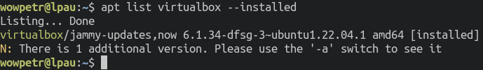  
2. Установлен Vagrant:  
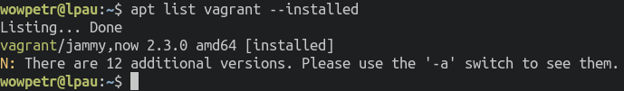  
3. Настроен удобный терминал:  
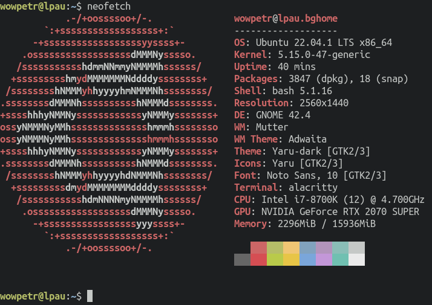  
4. Создал виртуальную машину посредством vagrant:  
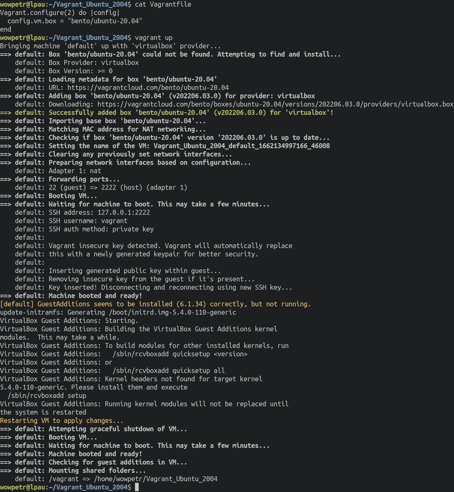  
5. Ознакомился еще раз с графическим интерфейсом VirtualBox и параметрами созданной виртуальной машины (ей выделено 1Гб ОЗУ и 2 CPU):  
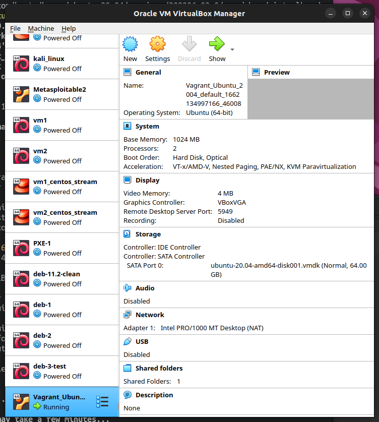  
6. Добавил оперативной памяти при помощи Vagrantfile (увеличил количество ОЗУ до 2Гб):  
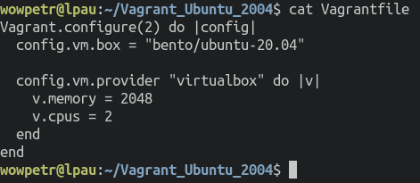  
7. Запустил виртуальную машину командой `vagrant up` и выполнил в ней несколько команд:  
  
8. Длину журнала `history` можно увеличить с помощью переменных окружения `HISTSIZE` и `HISTFILESIZE`, например так: `export HISTSIZE=10000` и `export HISTFILESIZE=10000`. Директива `ignoreboth` используется в переменной окружения `HISTCONTROL` для того чтобы удалить повторы команд и начальные пробелы выполняемых команд:  
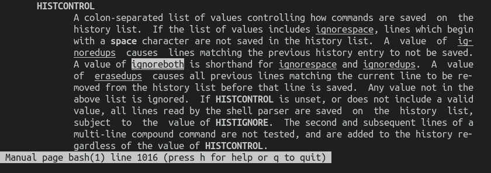  
9. Фигурные скобки используются для нескольких вещей. Одна из них указывает выполнять команды в текущем окружении, а не в дочернем вызове сохраняя результаты работы:  
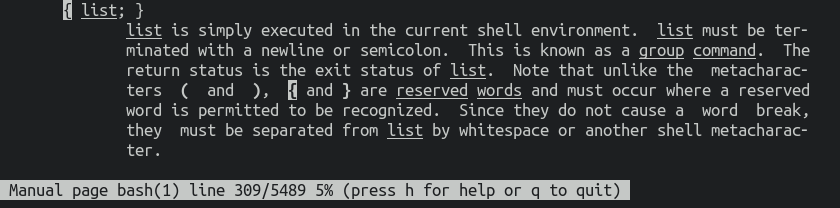  
Другое применение для фигурных скобок это выполнение выражение по списку параметров, например диапазон `{1..10}` указывает подставить вначале 1, затем 2 и так далее в выполняемую команду:    
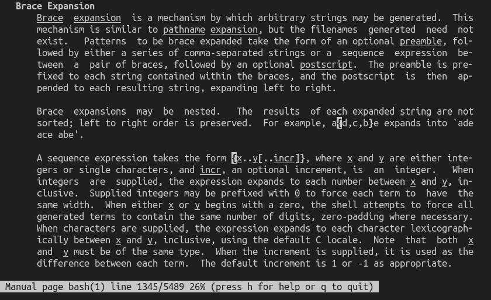  
10. Для создания 100 тысяч файлов можно воспользоваться следующей командой:  
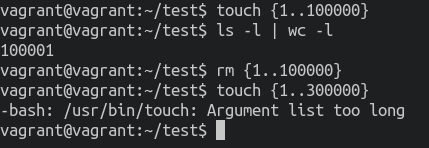  
Как мы видим, создать 300 тысяч файлов не удалось, так как превышено максимальное значение для диапазона.   
11. Поиск в man конструкции `/\[\[` дал следующее:  
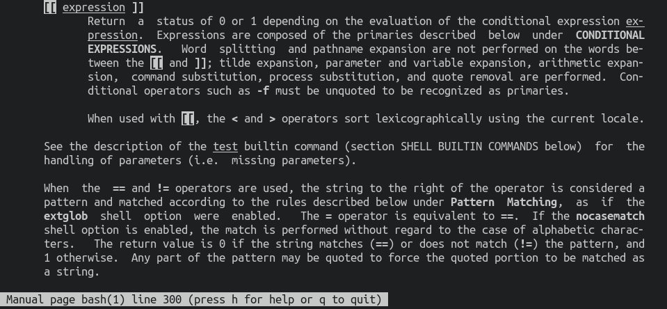  
Конструкция `[[ -d /tmp ]]` проверяет наличие директории `/tmp`:  
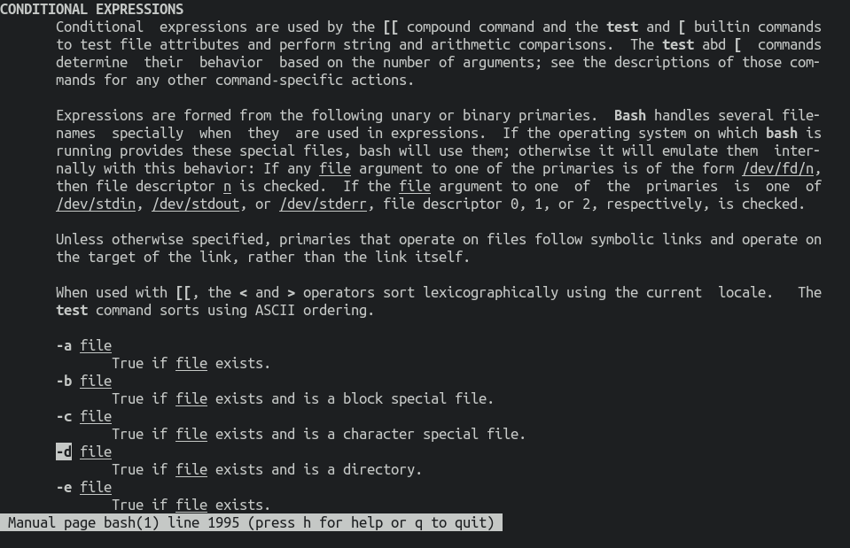  
12. Для достижения требуемого вывода командой `type -a`, использовались следующие команды:  
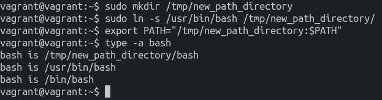  
13. Команда `batch` указывает, что нужно запланировать выполнение указанную далее команду когда загрузка процессора будет ниже уровня 1.5. Команда `at` указывает запланировать команду на конкретное время.  
14. Завершил работу виртуальной машины путем выхода по `Ctrl-D` и командой `vagrant halt`.