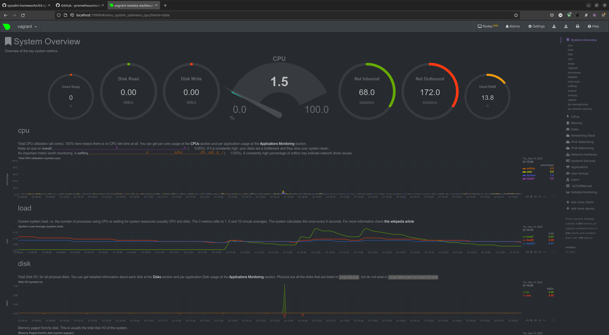

# Домашнее задание к занятию "3.4. Операционные системы, лекция 2"

1. На лекции мы познакомились с [node_exporter](https://github.com/prometheus/node_exporter/releases). В демонстрации его исполняемый файл запускался в background. Этого достаточно для демо, но не для настоящей production-системы, где процессы должны находиться под внешним управлением. Используя знания из лекции по systemd, создайте самостоятельно простой [unit-файл](https://www.freedesktop.org/software/systemd/man/systemd.service.html) для node_exporter:

    * поместите его в автозагрузку,
    * предусмотрите возможность добавления опций к запускаемому процессу через внешний файл (посмотрите, например, на `systemctl cat cron`),
    * удостоверьтесь, что с помощью systemctl процесс корректно стартует, завершается, а после перезагрузки автоматически поднимается.

    #### Решение:
    Командой `sudo systemctl edit --force --full node_exporter.service` был создан systemd сервис `node_exporter` следующего содержимого:
    ```bash
    vagrant@vagrant:~$ systemctl cat node_exporter.service
    # /etc/systemd/system/node_exporter.service
    [Unit]
    Description=Node Exporter
    After=docker.service
    Requires=docker.service

    [Service]
    TimeoutStartSec=0
    Restart=always
    EnvironmentFile=-/opt/node_exporter.conf
    ExecStartPre=-/usr/bin/docker exec %n stop
    ExecStartPre=-/usr/bin/docker rm %n
    ExecStartPre=/usr/bin/docker pull quay.io/prometheus/node-exporter:latest
    ExecStart=/usr/bin/docker run --rm --name %n \
      --net="host" \
      --pid="host" \
      -v "/:/host:ro,rslave" \
      quay.io/prometheus/node-exporter:latest \
      ${EXTRA_OPTS}

    [Install]
    WantedBy=multi-user.target
    ```
    Данный сервис запускает `node_exporter` при помощи docker, используя конфигурационный файл `/opt/node_exporter.conf`:
    ```
    EXTRA_OPTS=--path.rootfs=/host
    ```
    Сервис успешно запускается командой: `sudo systemctl start node_exporter`:

    ```
    vagrant@vagrant:~$ sudo systemctl status node_exporter
    ● node_exporter.service - Node Exporter
         Loaded: loaded (/etc/systemd/system/node_exporter.service; enabled; vendor preset: enabled)
         Active: active (running) since Thu 2022-09-15 15:35:31 UTC; 1h 38min ago
       Main PID: 1181 (docker)
          Tasks: 8 (limit: 2315)
         Memory: 43.3M
         CGroup: /system.slice/node_exporter.service
                 └─1181 /usr/bin/docker run --rm --name node_exporter.service --net=host --pid=host -v /:/host:ro,rslave quay.>

    Sep 15 15:35:31 vagrant docker[1181]: ts=2022-09-15T15:35:31.430Z caller=node_exporter.go:115 level=info collector=thermal>
    Sep 15 15:35:31 vagrant docker[1181]: ts=2022-09-15T15:35:31.430Z caller=node_exporter.go:115 level=info collector=time
    Sep 15 15:35:31 vagrant docker[1181]: ts=2022-09-15T15:35:31.430Z caller=node_exporter.go:115 level=info collector=timex
    Sep 15 15:35:31 vagrant docker[1181]: ts=2022-09-15T15:35:31.430Z caller=node_exporter.go:115 level=info collector=udp_que>
    Sep 15 15:35:31 vagrant docker[1181]: ts=2022-09-15T15:35:31.430Z caller=node_exporter.go:115 level=info collector=uname
    Sep 15 15:35:31 vagrant docker[1181]: ts=2022-09-15T15:35:31.430Z caller=node_exporter.go:115 level=info collector=vmstat
    Sep 15 15:35:31 vagrant docker[1181]: ts=2022-09-15T15:35:31.430Z caller=node_exporter.go:115 level=info collector=xfs
    Sep 15 15:35:31 vagrant docker[1181]: ts=2022-09-15T15:35:31.430Z caller=node_exporter.go:115 level=info collector=zfs
    Sep 15 15:35:31 vagrant docker[1181]: ts=2022-09-15T15:35:31.430Z caller=node_exporter.go:199 level=info msg="Listening on>
    Sep 15 15:35:31 vagrant docker[1181]: ts=2022-09-15T15:35:31.433Z caller=tls_config.go:195 level=info msg="TLS is disabled
    ```
   Командой `sudo systemctl enable node_exporter.service` сервис добавлен в автозагрузку.

1. Ознакомьтесь с опциями node_exporter и выводом `/metrics` по-умолчанию. Приведите несколько опций, которые вы бы выбрали для базового мониторинга хоста по CPU, памяти, диску и сети.

    #### Решение:
    Для базового мониторинга по CPU, памяти, диску и сети достаточно коллекторов по умолчанию: `cpu`, `meminfo`, `diskstats`, `filesystem`, `netclass`, `netdev`, `netstat`.

1. Установите в свою виртуальную машину [Netdata](https://github.com/netdata/netdata). Воспользуйтесь [готовыми пакетами](https://packagecloud.io/netdata/netdata/install) для установки (`sudo apt install -y netdata`). После успешной установки:
    * в конфигурационном файле `/etc/netdata/netdata.conf` в секции [web] замените значение с localhost на `bind to = 0.0.0.0`,
    * добавьте в Vagrantfile проброс порта Netdata на свой локальный компьютер и сделайте `vagrant reload`:

    ```bash
    config.vm.network "forwarded_port", guest: 19999, host: 19999
    ```

    После успешной перезагрузки в браузере *на своем ПК* (не в виртуальной машине) вы должны суметь зайти на `localhost:19999`. Ознакомьтесь с метриками, которые по умолчанию собираются Netdata и с комментариями, которые даны к этим метрикам.

    #### Решение:
    * Установлен Netdata с помощью команды: `sudo apt install netdata`.
    * Командой `wget -O /etc/netdata/netdata.conf http://localhost:19999/netdata.conf` заменен текущий конфиг на конфиг в настоящее время используется, но со всеми опциями, после чего заменено в секции [web] значение с localhost на `bind to = 0.0.0.0`.
    * В Vagrantfile добавлена строка: `config.vm.network "forwarded_port", guest: 19999, host: 19999` для проброски порта на хост из виртуальной машины, после чего виртуальная машина была перезагружена.
    
    Успешно открылась страница `localhost:19999` на хосте:
    

1. Можно ли по выводу `dmesg` понять, осознает ли ОС, что загружена не на настоящем оборудовании, а на системе виртуализации?

    #### Решение:
    Не знаю, "осознает" ли ОС, что находится в виртуальной машине, но, на нашей тестовой Vagrant виртуальной машине присутствует строчка в выводе dmesg: `DMI: innotek GmbH VirtualBox/VirtualBox, BIOS VirtualBox 12/01/2006` - по которой она может это "осознавать".

1. Как настроен sysctl `fs.nr_open` на системе по-умолчанию? Узнайте, что означает этот параметр. Какой другой существующий лимит не позволит достичь такого числа (`ulimit --help`)?

    #### Решение:
   Данный параметр определяет максимальное количество файловых дескрипторов, которых процесс может открыть. Значением по умолчанию является: `1024*1024 (1048576)`. Данное значение также ограничивается пользовательскими ограничениями оболочки: `ulimit -n`, которое по умолчанию равно `1024`.  

1. Запустите любой долгоживущий процесс (не `ls`, который отработает мгновенно, а, например, `sleep 1h`) в отдельном неймспейсе процессов; покажите, что ваш процесс работает под PID 1 через `nsenter`. Для простоты работайте в данном задании под root (`sudo -i`). Под обычным пользователем требуются дополнительные опции (`--map-root-user`) и т.д.

    #### Решение:
    ```bash
    root@vagrant:~# ps aux | grep sleep
    root        2214  0.0  0.0   5476   516 ?        S    18:50   0:00 /usr/bin/sleep 1h
    root        2218  0.0  0.0   5476   584 ?        S    18:51   0:00 /usr/bin/sleep 1h
    root        2264  0.0  0.0   5480   580 ?        S    18:55   0:00 unshare -f --pid --mount-proc /usr/bin/sleep 1h
    root        2265  0.0  0.0   5476   580 ?        S    18:55   0:00 /usr/bin/sleep 1h
    root        2278  0.0  0.0   6432   656 pts/0    S+   18:57   0:00 grep --color=auto sleep
    root@vagrant:~# nsenter --target 2265 --pid --mount
    root@vagrant:/# ps aux
    USER         PID %CPU %MEM    VSZ   RSS TTY      STAT START   TIME COMMAND
    root           1  0.0  0.0   5476   580 ?        S    18:55   0:00 /usr/bin/sleep 1h
    root           2  0.4  0.2   8308  5032 pts/0    S    18:59   0:00 -bash
    root          13  0.0  0.1   8888  3232 pts/0    R+   18:59   0:00 ps aux
    ```
1. Найдите информацию о том, что такое `:(){ :|:& };:`. Запустите эту команду в своей виртуальной машине Vagrant с Ubuntu 20.04 (**это важно, поведение в других ОС не проверялось**). Некоторое время все будет "плохо", после чего (минуты) – ОС должна стабилизироваться. Вызов `dmesg` расскажет, какой механизм помог автоматической стабилизации. Как настроен этот механизм по-умолчанию, и как изменить число процессов, которое можно создать в сессии?

    #### Решение:
    Данная конструкция называется fork bomb. Она представляет собой рекурсивный вызов одной и тоже же функции, что без специальных механизмов ограничения приводит к исчерпанию ресурсов. Для того чтобы ограничить пользователя на создание слишком большого числа процессов, используется ограничения `ulimit -u`. В моей виртуальной машине Vagrant этот лимит равен `7717`. У меня после того как этот лимит был достигнут и процесс завершился, в `dmesg` появилась следующая запись: 
`cgroup: fork rejected by pids controller in /user.slice/user-1000.slice/session-4.scope`.