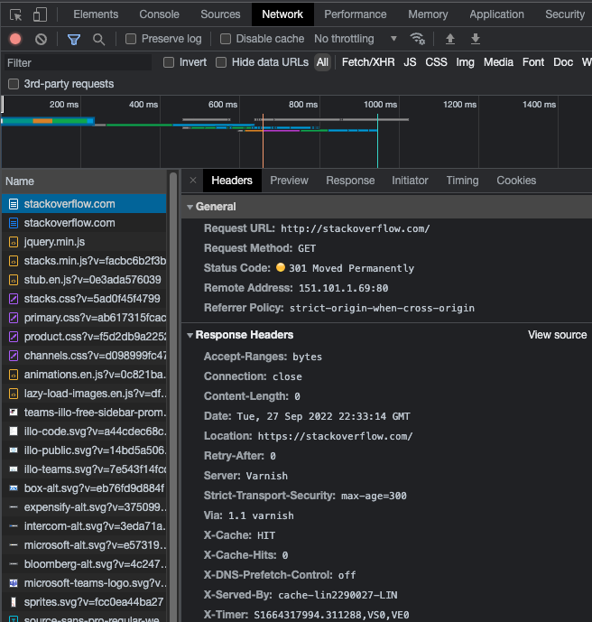
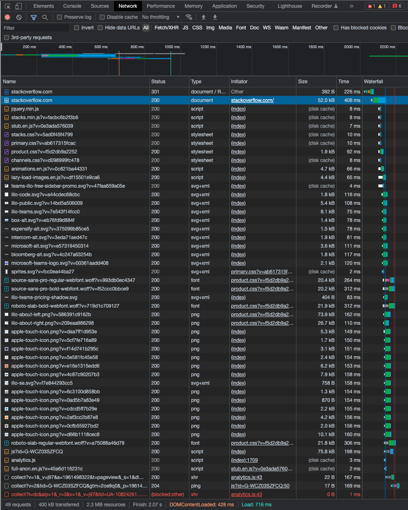
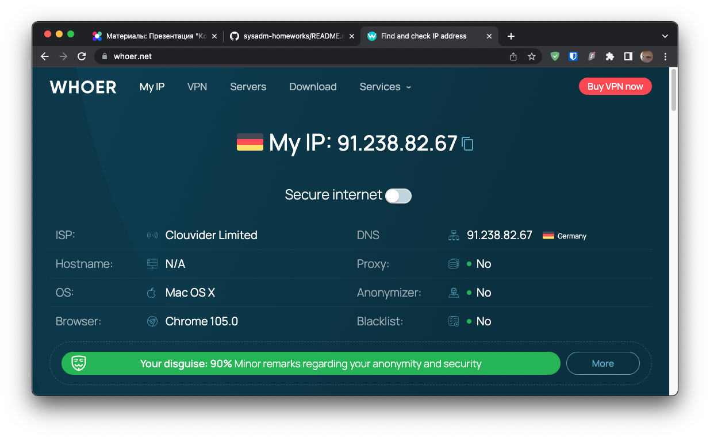

# Домашнее задание к занятию "3.6. Компьютерные сети, лекция 1"

1. Работа c HTTP через телнет.
- Подключитесь утилитой телнет к сайту stackoverflow.com
`telnet stackoverflow.com 80`
- отправьте HTTP запрос
```bash
GET /questions HTTP/1.0
HOST: stackoverflow.com
[press enter]
[press enter]
```
- В ответе укажите полученный HTTP код, что он означает?
    
    #### Решение:
    ```bash
    ~ ❯ telnet stackoverflow.com 80
    Trying 151.101.193.69...
    Connected to stackoverflow.com.
    Escape character is '^]'.
    GET /questions HTTP/1.0
    HOST: stackoverflow.com
    
    HTTP/1.1 301 Moved Permanently
    Server: Varnish
    Retry-After: 0
    Location: https://stackoverflow.com/questions
    Content-Length: 0
    Accept-Ranges: bytes
    Date: Tue, 27 Sep 2022 22:03:16 GMT
    Via: 1.1 varnish
    Connection: close
    X-Served-By: cache-lin2290028-LIN
    X-Cache: HIT
    X-Cache-Hits: 0
    X-Timer: S1664316196.260677,VS0,VE0
    Strict-Transport-Security: max-age=300
    X-DNS-Prefetch-Control: off
    
    Connection closed by foreign host.
    ```
    На запрос сервер вернул код возврата `301` (Moved Permanently). Данный код означает, что сайт был перемещен на другой адрес, при этом в `Location` указан новый адрес сайта: `https://stackoverflow.com/questions`.
2. Повторите задание 1 в браузере, используя консоль разработчика F12.
- откройте вкладку `Network`
- отправьте запрос http://stackoverflow.com
- найдите первый ответ HTTP сервера, откройте вкладку `Headers`
- укажите в ответе полученный HTTP код.
- проверьте время загрузки страницы, какой запрос обрабатывался дольше всего?
- приложите скриншот консоли браузера в ответ.
    
    #### Решение:
    При запросе того же сайта в инспекторе первый ответ HTTP сервера возвращает тот же код - `301 Moved Permanently`:  
    
    Общее время загрузки страницы: `701мс`.  
    Наибольшее время пришлось на второй запрос: `https://stackoverflow.com/`, который занял `406мс`:  
    

3. Какой IP адрес у вас в интернете?
    
    #### Решение:
    Мой IPv4 адрес: `91.238.82.67`:
    
5. Какому провайдеру принадлежит ваш IP адрес? Какой автономной системе AS? Воспользуйтесь утилитой `whois`
    
    #### Решение:
    Мой провайдер (ISP): `Clouvider Limited`.
5. Через какие сети проходит пакет, отправленный с вашего компьютера на адрес 8.8.8.8? Через какие AS? Воспользуйтесь утилитой `traceroute`
    
    #### Решение:
    ```bash
    ~ ❯ traceroute -a 8.8.8.8                                                                                           30s
    traceroute to 8.8.8.8 (8.8.8.8), 64 hops max, 52 byte packets
     1  [AS62240] 91.238.82.66 (91.238.82.66)  49.684 ms  48.081 ms  49.456 ms
     2  [AS0] 172.20.21.254 (172.20.21.254)  50.063 ms  48.029 ms  49.124 ms
     3  [AS0] 172.20.22.3 (172.20.22.3)  49.705 ms  48.416 ms  49.756 ms
     4  * * *
     5  [AS62240] 91.199.118.33 (91.199.118.33)  56.402 ms  54.881 ms  55.116 ms
     6  [AS62240] 91.199.118.0 (91.199.118.0)  51.224 ms  48.121 ms  49.878 ms
     7  [AS62240] 91.199.118.83 (91.199.118.83)  49.973 ms  48.459 ms  50.326 ms
     8  [AS15169] 108.170.251.193 (108.170.251.193)  50.127 ms
        [AS15169] 108.170.252.65 (108.170.252.65)  51.937 ms
        [AS15169] 108.170.251.193 (108.170.251.193)  49.865 ms
     9  [AS15169] 142.250.209.243 (142.250.209.243)  48.645 ms
        [AS15169] 142.250.214.187 (142.250.214.187)  50.199 ms
        [AS15169] 142.250.213.213 (142.250.213.213)  49.736 ms
    10  [AS15169] dns.google (8.8.8.8)  50.793 ms  49.938 ms  49.267 ms
    ```
6. Повторите задание 5 в утилите `mtr`. На каком участке наибольшая задержка - delay?
    
    #### Решение:
    ```bash
                                                      My traceroute  [v0.95]
    lpamac.local (10.6.2.10) -> 8.8.8.8 (8.8.8.8)                                                     2022-09-28T02:26:42+0300
    Keys:  Help   Display mode   Restart statistics   Order of fields   quit
                                                                                  Packets               Pings
    Host                                                                           Loss%   Snt   Last   Avg  Best  Wrst StDev
    1. AS62240  91.238.82.66                                                        0.0%    75   49.7  49.6  47.9  50.7   0.4
    2. AS???    172.20.21.254                                                       0.0%    75   50.7  49.6  48.8  50.7   0.4
    3. AS???    172.20.22.3                                                         0.0%    75   49.3  49.8  47.6  51.1   0.6
    4. (waiting for reply)
    5. AS62240  91.199.118.33                                                       0.0%    75   52.8  56.3  50.6  80.6   5.9
    6. AS62240  91.199.118.0                                                        0.0%    75   49.2  52.9  48.2 109.3  10.7
    7. AS62240  91.199.118.83                                                       0.0%    75   49.8  50.8  49.1  86.4   4.4
    8. AS15169  108.170.251.193                                                     0.0%    74   50.7  50.3  48.1  51.8   0.6
    9. AS15169  142.250.46.245                                                      0.0%    74   51.6  51.3  50.3  58.3   1.1
   10. AS15169  dns.google                                                          0.0%    74   50.3  50.2  47.8  51.3   0.5
    ```
   Откуда можно видеть, что наибольшая задержка была на 6ом прыжке (hop): `6. AS62240  91.199.118.0` , с худшей задержкой 109.3мс. 

7. Какие DNS сервера отвечают за доменное имя dns.google? Какие A записи? воспользуйтесь утилитой `dig`
    
    #### Решение:
    ```bash
    ~ ❯ dig dns.google

    ; <<>> DiG 9.10.6 <<>> dns.google
    ;; global options: +cmd
    ;; Got answer:
    ;; ->>HEADER<<- opcode: QUERY, status: NOERROR, id: 19980
    ;; flags: qr rd ra ad; QUERY: 1, ANSWER: 2, AUTHORITY: 13, ADDITIONAL: 1
    
    ;; OPT PSEUDOSECTION:
    ; EDNS: version: 0, flags:; udp: 4096
    ;; QUESTION SECTION:
    ;dns.google.			IN	A
    
    ;; ANSWER SECTION:
    dns.google.		900	IN	A	8.8.8.8
    dns.google.		900	IN	A	8.8.4.4
    
    ;; AUTHORITY SECTION:
    .			728	IN	NS	i.root-servers.net.
    .			728	IN	NS	a.root-servers.net.
    .			728	IN	NS	f.root-servers.net.
    .			728	IN	NS	e.root-servers.net.
    .			728	IN	NS	m.root-servers.net.
    .			728	IN	NS	d.root-servers.net.
    .			728	IN	NS	j.root-servers.net.
    .			728	IN	NS	g.root-servers.net.
    .			728	IN	NS	k.root-servers.net.
    .			728	IN	NS	h.root-servers.net.
    .			728	IN	NS	c.root-servers.net.
    .			728	IN	NS	b.root-servers.net.
    .			728	IN	NS	l.root-servers.net.
    
    ;; Query time: 118 msec
    ```
    Из запроса можно видеть DNS имеют имена вида: i.root-servers.net, a.root-servers.net, f.root-servers.net и так далее из раздела AUTHORITY SECTION.  
    A-записи: `dns.google.		900	IN	A	8.8.8.8` и `dns.google.		900	IN	A	8.8.4.4` из раздела ANSWER SECTION.
8. Проверьте PTR записи для IP адресов из задания 7. Какое доменное имя привязано к IP? воспользуйтесь утилитой `dig`
    
    #### Решение:
    ```bash
    ~ ❯ dig -x 8.8.8.8

    ; <<>> DiG 9.10.6 <<>> -x 8.8.8.8
    ;; global options: +cmd
    ;; Got answer:
    ;; ->>HEADER<<- opcode: QUERY, status: NOERROR, id: 15169
    ;; flags: qr rd ra; QUERY: 1, ANSWER: 1, AUTHORITY: 13, ADDITIONAL: 1
    
    ;; OPT PSEUDOSECTION:
    ; EDNS: version: 0, flags:; udp: 4096
    ;; QUESTION SECTION:
    ;8.8.8.8.in-addr.arpa.		IN	PTR
    
    ;; ANSWER SECTION:
    8.8.8.8.in-addr.arpa.	939	IN	PTR	dns.google
    <...>
    ~ ❯ dig -x 8.8.4.4

    ; <<>> DiG 9.10.6 <<>> -x 8.8.4.4
    ;; global options: +cmd
    ;; Got answer:
    ;; ->>HEADER<<- opcode: QUERY, status: NOERROR, id: 10275
    ;; flags: qr rd ra; QUERY: 1, ANSWER: 1, AUTHORITY: 13, ADDITIONAL: 1
    
    ;; OPT PSEUDOSECTION:
    ; EDNS: version: 0, flags:; udp: 4096
    ;; QUESTION SECTION:
    ;4.4.8.8.in-addr.arpa.		IN	PTR
    
    ;; ANSWER SECTION:
    4.4.8.8.in-addr.arpa.	3600	IN	PTR	dns.google.
    <...>
    ```
    Можно видеть из запросов возвращена PTR записи для адресов `8.8.8.8` и `8.8.4.4`:
    `8.8.8.8.in-addr.arpa.	939	IN	PTR	dns.google` и `4.4.8.8.in-addr.arpa.	3600	IN	PTR	dns.google.` соответственно.