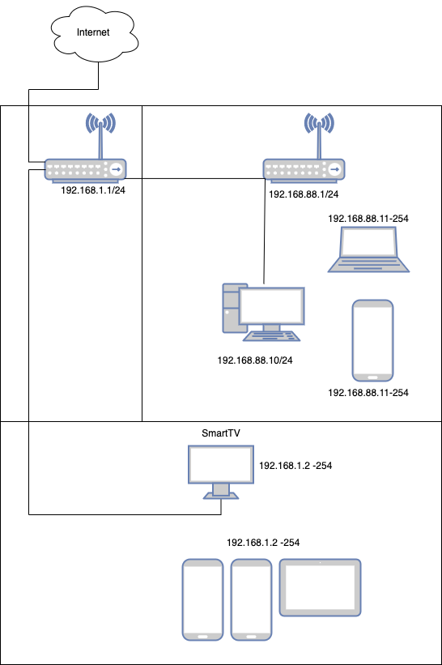

# Домашнее задание к занятию "3.8. Компьютерные сети, лекция 3"

1. Подключитесь к публичному маршрутизатору в интернет. Найдите маршрут к вашему публичному IP
    ```
    telnet route-views.routeviews.org
    Username: rviews
    show ip route x.x.x.x/32
    show bgp x.x.x.x/32
    ```
    #### Решение:
    ```
    202.232.0.2 from 202.232.0.2 (58.138.96.254)
      Origin IGP, localpref 100, valid, external, best
      path 7FE0EF491900 RPKI State not found
      rx pathid: 0, tx pathid: 0x0
    ```
2. Создайте dummy0 интерфейс в Ubuntu. Добавьте несколько статических маршрутов. Проверьте таблицу маршрутизации.

    #### Решение:
    Для инициализации dummy0 интерфейса использовал systemd. Создал следующие два файла:  
    `/etc/systemd/network/10-dummy0.netdev`: 
    ```
    [NetDev]
    Name=dummy0
    Kind=dummy
    ```
    `/etc/systemd/network/20-dummy0.network`:
    ```
    [Match]
    Name=dummy0

    [Network]
    Address=10.2.2.2/32
   
    [Route]
    Gateway=10.2.2.2
    Destination=192.168.155.0/24
    
    [Route]
    Gateway=10.2.2.2
    Destination=192.168.160.0/24
    ```
    После перезагрузки сервиса `systemd-networkd` появился требуемый dummy-интерфейс и прописанные статические маршруты:
    ```bash
    vagrant@vagrant:~$ sudo systemctl restart systemd-networkd
    lo               UNKNOWN        127.0.0.1/8 ::1/128
    eth0             UP             10.0.2.15/24 fe80::a00:27ff:fea2:6bfd/64
    dummy0           UNKNOWN        10.2.2.2/32 fe80::7cf5:36ff:fe7a:8907/64
    docker0          DOWN           172.17.0.1/16
    vagrant@vagrant:~$ ip r show dev dummy0
    192.168.155.0/24 via 10.2.2.2 proto static
    192.168.160.0/24 via 10.2.2.2 proto static
    ```

3. Проверьте открытые TCP порты в Ubuntu, какие протоколы и приложения используют эти порты? Приведите несколько примеров.

    #### Решение:
    ```bash
    vagrant@vagrant:~$ sudo ss -tlpn
    State     Recv-Q    Send-Q       Local Address:Port       Peer Address:Port   Process
    LISTEN    0         4096         127.0.0.53%lo:53              0.0.0.0:*       users:(("systemd-resolve",pid=625,fd=13))
    LISTEN    0         128                0.0.0.0:22              0.0.0.0:*       users:(("sshd",pid=713,fd=3))
    LISTEN    0         4096                     *:9100                  *:*       users:(("node_exporter",pid=1249,fd=3))
    LISTEN    0         128                   [::]:22                 [::]:*       users:(("sshd",pid=713,fd=4))
    ```
    Открыты следующие TCP порты: 53 (systemd-resolve) - DNS, 22 (sshd) - SSH Сервер, 9100 (node_exporter) - HTTP /metrics.

4. Проверьте используемые UDP сокеты в Ubuntu, какие протоколы и приложения используют эти порты?
    #### Решение:
    ```bash
    vagrant@vagrant:~$ sudo ss -ulpn
    State    Recv-Q    Send-Q        Local Address:Port       Peer Address:Port   Process
    UNCONN   0         0             127.0.0.53%lo:53              0.0.0.0:*       users:(("systemd-resolve",pid=625,fd=12))
    UNCONN   0         0            10.0.2.15%eth0:68              0.0.0.0:*       users:(("systemd-network",pid=1624,fd=22))
    ```
    Открыты следующие UDP порты: 53 (systemd-resolve) - DNS, 68 (systemd-network) - BOOTP / DHCP.

5. Используя diagrams.net, создайте L3 диаграмму вашей домашней сети или любой другой сети, с которой вы работали. 
    #### Решение:

 ---
## Задание для самостоятельной отработки (необязательно к выполнению)

6*. Установите Nginx, настройте в режиме балансировщика TCP или UDP.

7*. Установите bird2, настройте динамический протокол маршрутизации RIP.

8*. Установите Netbox, создайте несколько IP префиксов, используя curl проверьте работу API.

