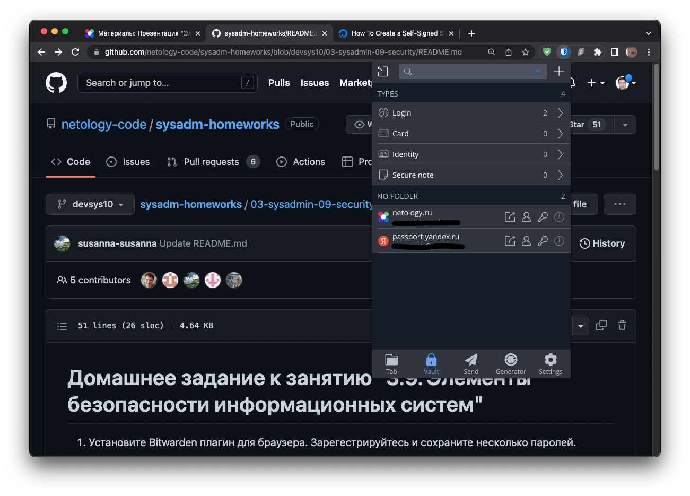
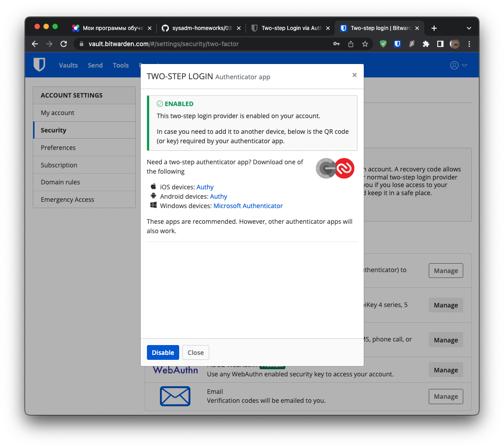
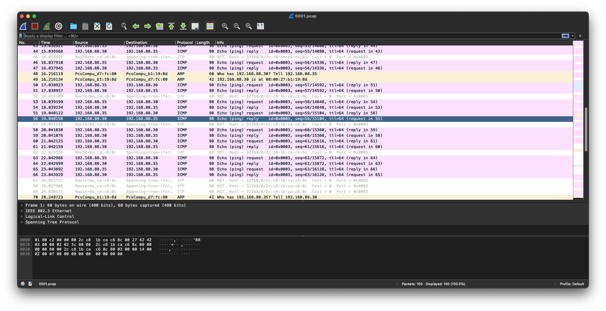

# Домашнее задание к занятию "3.9. Элементы безопасности информационных систем"

1. Установите Bitwarden плагин для браузера. Зарегестрируйтесь и сохраните несколько паролей.
    #### Решение:
    
2. Установите Google authenticator на мобильный телефон. Настройте вход в Bitwarden акаунт через Google authenticator OTP.
    #### Решение:
    
3. Установите apache2, сгенерируйте самоподписанный сертификат, настройте тестовый сайт для работы по HTTPS.
    #### Решение:
    Установил apache2:  
    ```bash
    vagrant@vagrant:~$ apt list 'apache2' --installed
    Listing... Done
    apache2/focal-updates,focal-security,now 2.4.41-4ubuntu3.12 amd64 [installed]
    ```
   
    Включил модуль ssl командой: `sudo a2enmod ssl`:
    ```bash
    vagrant@vagrant:~$ sudo apache2ctl -M | grep ssl
    ssl_module (shared)
    ```
    
    Сгенерировал новый SSL сертификат:
    ```bash
    vagrant@vagrant:~$ sudo openssl req -x509 -nodes -days 365 -newkey rsa:2048 -keyout /etc/ssl/private/apache-selfsigned.key -out /etc/ssl/certs/apache-selfsigned.crt
    Generating a RSA private key
    .......................................+++++
    .................................................................................................................................+++++
    writing new private key to '/etc/ssl/private/apache-selfsigned.key'
    -----
    You are about to be asked to enter information that will be incorporated
    into your certificate request.
    What you are about to enter is what is called a Distinguished Name or a DN.
    There are quite a few fields but you can leave some blank
    For some fields there will be a default value,
    If you enter '.', the field will be left blank.
    -----
    Country Name (2 letter code) [AU]:RU
    State or Province Name (full name) [Some-State]:Russia
    Locality Name (eg, city) []:Moscow
    Organization Name (eg, company) [Internet Widgits Pty Ltd]:Netology
    Organizational Unit Name (eg, section) []:DevOps
    Common Name (e.g. server FQDN or YOUR name) []:vagrant
    Email Address []:
    ```
   
    Создал конфигурационный файл Apache2:
    ```bash
    vagrant@vagrant:~$ cat /etc/apache2/sites-available/vagrant.conf
    <VirtualHost *:443>
       ServerName vagrant
       DocumentRoot /var/www/vagrant
    
       SSLEngine on
       SSLCertificateFile /etc/ssl/certs/apache-selfsigned.crt
       SSLCertificateKeyFile /etc/ssl/private/apache-selfsigned.key
    </VirtualHost>
    ```
    Данный конфигурационный файл добавил командой: `sudo a2ensite vagrant.conf`.
   
    Создал корневую директорию сайта `/var/www/vagrant` и `index.html`:
    ```bash
    vagrant@vagrant:~$ cat /var/www/vagrant/index.html
    <h1>it worked!</h1>
    ```

    После перезапуска сервиса, проверил работоспособность сайта:
    ```bash
    vagrant@vagrant:~$ curl -k "https://localhost"
    <h1>it worked!</h1>    
    ```
4. Проверьте на TLS уязвимости произвольный сайт в интернете (кроме сайтов МВД, ФСБ, МинОбр, НацБанк, РосКосмос, РосАтом, РосНАНО и любых госкомпаний, объектов КИИ, ВПК ... и тому подобное).
    #### Решение:
    ```bash
    vagrant@vagrant:~/testssl.sh$ ./testssl.sh -U --sneaky --parallel https://netology.ru
    <...>
    Testing vulnerabilities
  
     Heartbleed (CVE-2014-0160)                not vulnerable (OK), no heartbeat extension
     CCS (CVE-2014-0224)                       not vulnerable (OK)
     Ticketbleed (CVE-2016-9244), experiment.  not vulnerable (OK), no session tickets
     ROBOT                                     not vulnerable (OK)
     Secure Renegotiation (RFC 5746)           OpenSSL handshake didn't succeed
     Secure Client-Initiated Renegotiation     not vulnerable (OK)
     CRIME, TLS (CVE-2012-4929)                not vulnerable (OK)
     BREACH (CVE-2013-3587)                    potentially NOT ok, "gzip" HTTP compression detected. - only supplied "/" tested
                                               Can be ignored for static pages or if no secrets in the page
     POODLE, SSL (CVE-2014-3566)               not vulnerable (OK)
     TLS_FALLBACK_SCSV (RFC 7507)              Downgrade attack prevention supported (OK)
     SWEET32 (CVE-2016-2183, CVE-2016-6329)    VULNERABLE, uses 64 bit block ciphers
     FREAK (CVE-2015-0204)                     not vulnerable (OK)
     DROWN (CVE-2016-0800, CVE-2016-0703)      not vulnerable on this host and port (OK)
                                               make sure you don't use this certificate elsewhere with SSLv2 enabled services, see
                                               https://search.censys.io/search?resource=hosts&virtual_hosts=INCLUDE&q=A3C7D9A8D3805171D99EA61F5C80B8ADF49B93BA21EBB492D78512BA254E90A5
     LOGJAM (CVE-2015-4000), experimental      not vulnerable (OK): no DH EXPORT ciphers, no DH key detected with <= TLS 1.2
     BEAST (CVE-2011-3389)                     TLS1: ECDHE-RSA-AES128-SHA AES128-SHA ECDHE-RSA-AES256-SHA AES256-SHA
                                                     DES-CBC3-SHA
                                               VULNERABLE -- but also supports higher protocols  TLSv1.1 TLSv1.2 (likely mitigated)
     LUCKY13 (CVE-2013-0169), experimental     potentially VULNERABLE, uses cipher block chaining (CBC) ciphers with TLS. Check patches
     Winshock (CVE-2014-6321), experimental    not vulnerable (OK)
     RC4 (CVE-2013-2566, CVE-2015-2808)        no RC4 ciphers detected (OK)
    ```
5. Установите на Ubuntu ssh сервер, сгенерируйте новый приватный ключ. Скопируйте свой публичный ключ на другой сервер. Подключитесь к серверу по SSH-ключу.
    #### Решение:
    На основой виртуальной машине сгенерирован новый приватный ключ в файле `/home/vagrant/.ssh/vagr-tmp` и его открытая часть в `/home/vagrant/.ssh/vagr-tmp.pub`:
    ```bash
    vagrant@vagrant:~$ ssh-keygen
    Generating public/private rsa key pair.
    Enter file in which to save the key (/home/vagrant/.ssh/id_rsa): /home/vagrant/.ssh/vagr-tmp
    Enter passphrase (empty for no passphrase):
    Enter same passphrase again:
    Your identification has been saved in /home/vagrant/.ssh/vagr-tmp
    Your public key has been saved in /home/vagrant/.ssh/vagr-tmp.pub
    The key fingerprint is:
    SHA256:X4R/RwvFUx7NckdzD9dm+BK58N4/kTzkYBh57MixNvM vagrant@vagrant
    The key's randomart image is:
    +---[RSA 3072]----+
    |            o oOO|
    |           =.o**&|
    |          o X+ O*|
    |           @ +=oo|
    |        S . B.*+o|
    |         . . E.B.|
    |          .     +|
    |               ..|
    |                .|
    +----[SHA256]-----+ 
    ```
    В конфиг Vagrant основной виртуальной машины добавил сетевой интерфейс через мост: `config.vm.network "public_network", ip: "192.168.88.30"`.  
    Создал дополнительную виртуальную машину с сетевым интерфейсом через мост c конфигом Vagrant: `config.vm.network "public_network", ip: "192.168.88.35"`.  
    Скопировал ключ с основной виртуальной машины на вторую:
    ```bash
    vagrant@vagrant:~$ ssh-copy-id -i ~/.ssh/vagr-tmp 192.168.88.35
    /usr/bin/ssh-copy-id: INFO: Source of key(s) to be installed: "/home/vagrant/.ssh/vagr-tmp.pub"
    The authenticity of host '192.168.88.35 (192.168.88.35)' can't be established.
    ECDSA key fingerprint is SHA256:8Lb/tKqeyNQllMhaDRbn8d8aX/ef6T2IkQ5EWnKa01s.
    Are you sure you want to continue connecting (yes/no/[fingerprint])? yes
    /usr/bin/ssh-copy-id: INFO: attempting to log in with the new key(s), to filter out any that are already installed
    /usr/bin/ssh-copy-id: INFO: 1 key(s) remain to be installed -- if you are prompted now it is to install the new keys
    vagrant@192.168.88.35's password:
    
    Number of key(s) added: 1
    
    Now try logging into the machine, with:   "ssh '192.168.88.35'"
    and check to make sure that only the key(s) you wanted were added.
    ```
    Успешно вошел по SSH без запроса пароля:
    ```bash
    vagrant@vagrant:~$ ssh -i ~/.ssh/vagr-tmp 192.168.88.35
    Welcome to Ubuntu 20.04.4 LTS (GNU/Linux 5.4.0-110-generic x86_64)
    <...>
    ```
6. Переименуйте файлы ключей из задания 5. Настройте файл конфигурации SSH клиента, так чтобы вход на удаленный сервер осуществлялся по имени сервера.
    #### Решение:
    В файл `/etc/hosts` добавил удаленный сервер:
    ```bash
    vagrant@vagrant:~$ cat /etc/hosts | grep vagrant-35
    192.168.88.35 vagrant-35
    ```
    Добавил конфиг SSH на основной виртуальной машине:
    ```bash
    vagrant@vagrant:~$ cat ~/.ssh/config
    Host vagrant-35
    User=vagrant
    IdentityFile ~/.ssh/vagr-tmp
    ```
    Успешно вошел через SSH по имени `vagrant-35` на удаленный сервер:
    ```bash
    vagrant@vagrant:~$ ssh vagrant-35
    The authenticity of host 'vagrant-35 (192.168.88.35)' can't be established.
    ECDSA key fingerprint is SHA256:8Lb/tKqeyNQllMhaDRbn8d8aX/ef6T2IkQ5EWnKa01s.
    Are you sure you want to continue connecting (yes/no/[fingerprint])? yes
    Warning: Permanently added 'vagrant-35' (ECDSA) to the list of known hosts.
    Welcome to Ubuntu 20.04.4 LTS (GNU/Linux 5.4.0-110-generic x86_64)
    <...>
    ```
7. Соберите дамп трафика утилитой tcpdump в формате pcap, 100 пакетов. Откройте файл pcap в Wireshark.
    #### Решение:
    ```bash
    vagrant@vagrant:~$ sudo tcpdump -c 100 -i eth1 -w 0001.pcap
    tcpdump: listening on eth1, link-type EN10MB (Ethernet), capture size 262144 bytes
    100 packets captured
    102 packets received by filter
    0 packets dropped by kernel
    ```
    
 ---
## Задание для самостоятельной отработки (необязательно к выполнению)

8*. Просканируйте хост scanme.nmap.org. Какие сервисы запущены?

9*. Установите и настройте фаервол ufw на web-сервер из задания 3. Откройте доступ снаружи только к портам 22,80,443

