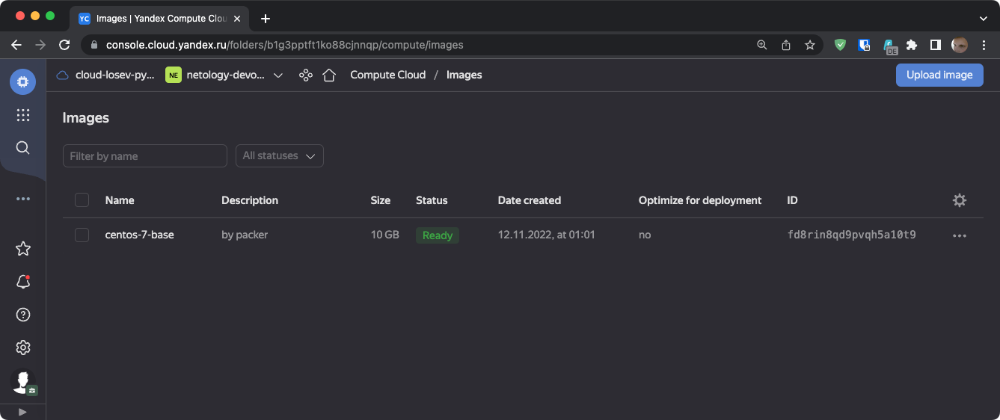
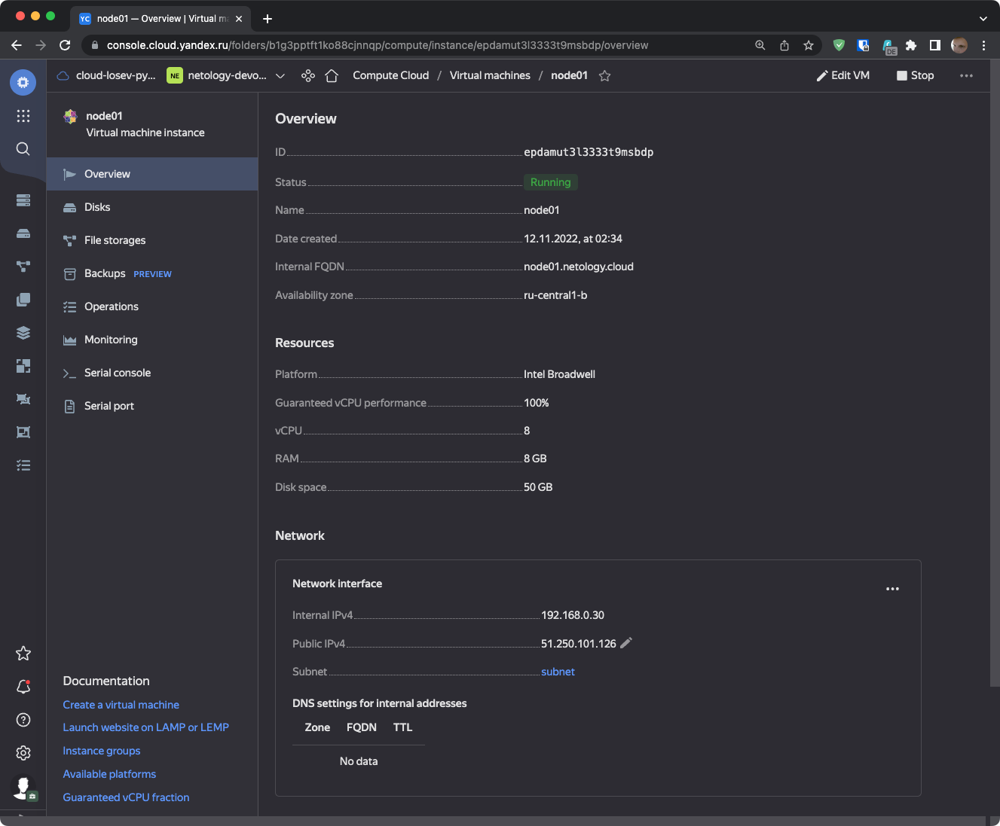
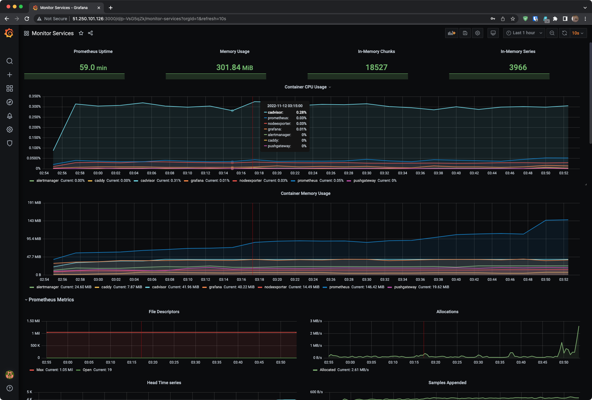

# Домашнее задание к занятию "4. Оркестрация группой Docker контейнеров на примере Docker Compose"

## Задача 1

Создать собственный образ операционной системы с помощью Packer.

Для получения зачета, вам необходимо предоставить:
- Скриншот созданного образа на Yandex Cloud 

### Решение
1. Установил утилиту `yc`:
```bash
~ ❯ curl -sSL https://storage.yandexcloud.net/yandexcloud-yc/install.sh | bash
...
~ ❯ yc --version
Yandex Cloud CLI 0.97.0 darwin/arm64
```
2. Произвел инициализацию утилиты Yandex Cloud CLI: `yc init` с созданием новой папки в облаке с именем `netology-devops`:
```bash
~ ❯ yc config list
token: <censored>
cloud-id: <censored>
folder-id: <censored>
compute-default-zone: ru-central1-b
~ ❯ yc resource-manager folder list
+----------------------+-----------------+--------+--------+
|          ID          |      NAME       | LABELS | STATUS |
+----------------------+-----------------+--------+--------+
| <censored>           | default         |        | ACTIVE |
| <censored>           | netology-devops |        | ACTIVE |
+----------------------+-----------------+--------+--------+
```
3. Создал сеть и подсеть с помощью terraform:  
    network.tf
    ```terraform
    resource "yandex_vpc_network" "netology-devops-network" {
      name = "net"
    }

    resource "yandex_vpc_subnet" "default" {
      name           = "subnet"
      zone           = "ru-central1-b"
      network_id     = "${yandex_vpc_network.netology-devops-network.id}"
      v4_cidr_blocks = ["192.168.0.0/24"]
    }
    ```
    Выполнил команду создания только сети так как в каталоге были и другие ресурсы, которые нельзя было создать без создания образа в Packer:
    ```bash
    ❯ terraform apply --target=yandex_vpc_subnet.default
    ```
4. Создал сервисный аккаунт и IAM ключ записанный в key.json:
    ```bash
    ❯ yc iam service-account create netology-devops-sa
    ❯ yc iam key create --service-account-name netology-devops-sa --output key.json
    ```
5. Установил Packer:
    ```bash
    ~ ❯ brew install packer
    ...
    ~ ❯ packer --version
    1.8.4 
    ```
6. Описал конфиг для Packer:  
    centos-7-base.json
    ```json
    {
        "builders": [
            {
                "disk_type": "network-nvme",
                "folder_id": "<censored>",
                "image_description": "by packer",
                "image_family": "centos",
                "image_name": "centos-7-base",
                "source_image_family": "centos-7",
                "ssh_username": "centos",
                "subnet_id": "e2lqmnj563i1fkj520u8",
                "token": "<censored>",
                "type": "yandex",
                "use_ipv4_nat": true,
                "zone": "ru-central1-b"
            }
        ],
        "provisioners": [
            {
                "inline": [
                    "sudo yum -y update",
                    "sudo yum -y install bridge-utils bind-utils iptables curl net-tools tcpdump rsync telnet openssh-server"
                ],
                "type": "shell"
            }
        ]
    }
    ```
7. Собрал образ с помощью Packer:
    ```bash
    ❯ packer build centos-7-base.json
    ...
    ~ ❯ yc compute image list
    +----------------------+---------------+--------+----------------------+--------+
    |          ID          |     NAME      | FAMILY |     PRODUCT IDS      | STATUS |
    +----------------------+---------------+--------+----------------------+--------+
    | fd8rin8qd9pvqh5a10t9 | centos-7-base | centos | f2euv1kekdgvc0jrpaet | READY  |
    +----------------------+---------------+--------+----------------------+--------+
    ```
8. Скриншот созданного образа на Yandex Cloud:
    

## Задача 2

Создать вашу первую виртуальную машину в Яндекс.Облаке.

Для получения зачета, вам необходимо предоставить:
- Скриншот страницы свойств созданной ВМ на Yandex Cloud

### Решение

1. Описал следующие файлы terraform для создания виртуальной машины:
    * [network.tf](./src/terraform/network.tf)
    * [node01.tf](./src/terraform/node01.tf)
    * [output.tf](./src/terraform/output.tf)
    * [variables.tf](./src/terraform/variables.tf)

2. Создал виртуальную машину:
    ```bash
    ❯ terraform plan 
    ...
    ❯ terraform apply 
    ...
    Apply complete! Resources: 1 added, 0 changed, 0 destroyed.

    Outputs:

    external_ip_address_node01_yandex_cloud = "51.250.101.126"
    internal_ip_address_node01_yandex_cloud = "192.168.0.30"
    ```

3. Скриншот созданной виртуальной машины на Yandex Cloud:


## Задача 3

Создать ваш первый готовый к боевой эксплуатации компонент мониторинга, состоящий из стека микросервисов.
Для получения зачета, вам необходимо предоставить:
- Скриншот работающего веб-интерфейса Grafana с текущими метриками

### Решение

1. Использованы файлы ansible предоставленные в задании, с которыми можно ознакомиться по [ссылке](./src/ansible/).

2. Запущен playbook Ansible:
    ```bash
    ❯ ansible-playbook provision.yml

    PLAY [nodes] ********************************************************************************************************************************************************************************************

    TASK [Gathering Facts] **********************************************************************************************************************************************************************************
    ok: [node01.netology.cloud]

    TASK [Create directory for ssh-keys] ********************************************************************************************************************************************************************
    ok: [node01.netology.cloud]

    TASK [Adding rsa-key in /root/.ssh/authorized_keys] *****************************************************************************************************************************************************
    An exception occurred during task execution. To see the full traceback, use -vvv. The error was: If you are using a module and expect the file to exist on the remote, see the remote_src option
    fatal: [node01.netology.cloud]: FAILED! => {"changed": false, "msg": "Could not find or access '~/.ssh/id_rsa.pub' on the Ansible Controller.\nIf you are using a module and expect the file to exist on the remote, see the remote_src option"}
    ...ignoring

    TASK [Checking DNS] *************************************************************************************************************************************************************************************
    changed: [node01.netology.cloud]

    TASK [Installing tools] *********************************************************************************************************************************************************************************
    changed: [node01.netology.cloud] => (item=git)
    ok: [node01.netology.cloud] => (item=curl)

    TASK [Add docker repository] ****************************************************************************************************************************************************************************
    changed: [node01.netology.cloud]

    TASK [Installing docker package] ************************************************************************************************************************************************************************
    changed: [node01.netology.cloud] => (item=docker-ce)
    ok: [node01.netology.cloud] => (item=docker-ce-cli)
    ok: [node01.netology.cloud] => (item=containerd.io)

    TASK [Enable docker daemon] *****************************************************************************************************************************************************************************
    changed: [node01.netology.cloud]

    TASK [Install docker-compose] ***************************************************************************************************************************************************************************
    changed: [node01.netology.cloud]

    TASK [Synchronization] **********************************************************************************************************************************************************************************
    changed: [node01.netology.cloud]

    TASK [Pull all images in compose] ***********************************************************************************************************************************************************************
    changed: [node01.netology.cloud]

    TASK [Up all services in compose] ***********************************************************************************************************************************************************************
    changed: [node01.netology.cloud]

    PLAY RECAP **********************************************************************************************************************************************************************************************
    node01.netology.cloud      : ok=12   changed=9    unreachable=0    failed=0    skipped=0    rescued=0    ignored=1
    ```
3. Выполнен вход в по внешнему адресу сервиса Grafana и произведен импорт дашбордов.

4. Скриншот сервиса Grafana с отрытым дашбордом Monitor Services: 


5. Уничтожил созданные ранее ресурсы (сеть, подсеть и виртуальную машину):
    ```bash
    ❯ terraform destroy
    ...
    Destroy complete! Resources: 3 destroyed.
    ```