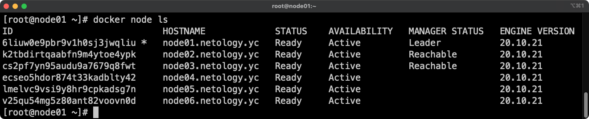

# Домашнее задание к занятию "5.5 Оркестрация кластером Docker контейнеров на примере Docker Swarm"

## Задача 1

Дайте ответы на следующие вопросы:

- В чём отличие режимов работы сервисов в Docker Swarm кластере: replication и global?
#### Решение
Есть два типа сервисов: replicated и global. Replicated сервисы создаются по умолчанию, но нужно указать количество реплик флагом `--replicas` и числом после него. В этом случает будет развернуто указанное число реплик на доступных узлах. Global сервисы задаются флагом `--mode global` и в этом случае на всех свободных узлах будет создано по одной задаче.
- Какой алгоритм выбора лидера используется в Docker Swarm кластере?
#### Решение
Используется алгоритм Raft для поиска консенсуса в выборе лидера.

Описание  
Если обычный узел долго не получает сообщений от лидера, то он переходит в состояние «кандидат» и посылает другим узлам запрос на голосование. Другие узлы голосуют за того кандидата, от которого они получили первый запрос. Если кандидат получает сообщение от лидера, то он снимает свою кандидатуру и возвращается в обычное состояние. Если кандидат получает большинство голосов, то он становится лидером. Если же он не получил большинства (это случай, когда на кластере возникли сразу несколько кандидатов и голоса разделились), то кандидат ждёт случайное время и инициирует новую процедуру голосования. Процедура голосования повторяется, пока не будет выбран лидер.

- Что такое Overlay Network?
#### Решение
Оверлейная сеть (Overlay Network) — общий случай логической сети, создаваемой поверх другой сети.
Overlay-сети используются в контексте кластеров (Docker Swarm), где виртуальная сеть, которую используют контейнеры, связывает несколько физических хостов, на которых запущен Docker. По умолчанию создается `ingress` сеть для установки соединений из вне. Также создается bridge-сеть `docker_gwbridge` для поддержания связи между разными узлами.  

## Задача 2

Создать ваш первый Docker Swarm кластер в Яндекс.Облаке

Для получения зачета, вам необходимо предоставить скриншот из терминала (консоли), с выводом команды:
```
docker node ls
```
### Решение
Вывод команды `docker node ls`:

#### Примечание
Для решения использованы файлы (IaC), взятые из исходного задания с которыми можно ознакомиться [здесь](./src/).  

Для создания образа использовалась команда:
```bash
packer build centos-7-base.json
```
Для построения инфрастуктуры использовалась команда:
```bash
terraform apply
```

## Задача 3

Создать ваш первый, готовый к боевой эксплуатации кластер мониторинга, состоящий из стека микросервисов.

Для получения зачета, вам необходимо предоставить скриншот из терминала (консоли), с выводом команды:
```
docker service ls
```
### Решение
Вывод команды `docker service ls`:


#### Примечание
Для решения использованы файлы (IaC), взятые из исходного задания с которыми можно ознакомиться [здесь](./src/).  

Команда `terraform apply` также создает файлы inventory для ansible и выполняет provisioning всех создаваемых хостов с помощью ansible, который в свою очередь использует docker swarm для разворачивания служб мониторинга.

## Задача 4 (*)

Выполнить на лидере Docker Swarm кластера команду (указанную ниже) и дать письменное описание её функционала, что она делает и зачем она нужна:
```
# см.документацию: https://docs.docker.com/engine/swarm/swarm_manager_locking/
docker swarm update --autolock=true
```
### Решение


Данный функционал позволяет установить шифрование Raft логов. В случае перезапуска дается ключ для разблокировки менеджера.