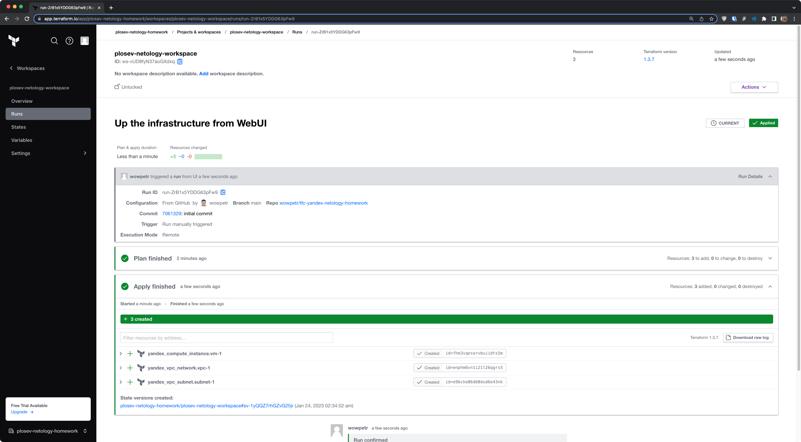

# Домашнее задание к занятию "7.4. Средства командной работы над инфраструктурой."

## Задача 1. Настроить terraform cloud (необязательно, но крайне желательно).

В это задании предлагается познакомиться со средством командой работы над инфраструктурой предоставляемым
разработчиками терраформа. 

1. Зарегистрируйтесь на [https://app.terraform.io/](https://app.terraform.io/).
(регистрация бесплатная и не требует использования платежных инструментов).
1. Создайте в своем github аккаунте (или другом хранилище репозиториев) отдельный репозиторий с
 конфигурационными файлами прошлых занятий (или воспользуйтесь любым простым конфигом).
1. Зарегистрируйте этот репозиторий в [https://app.terraform.io/](https://app.terraform.io/).
1. Выполните plan и apply. 

В качестве результата задания приложите снимок экрана с успешным применением конфигурации.

### Решение

1. Создал аккаунт на Terraform Cloud и создал организацию `plosev-netology-homework`.
1. Создал локальный репозиторий git c файлами конфигурации Terraform (Yandex провайдер) через `git init -b main`. Репозиторий был позднее отправлен на GitHub с помощью `gh repo create`. С репозиторием можно ознакомиться по [ссылке](https://github.com/wowpetr/tfc-yandex-netology-homework/tree/v1).
1. Выполнил `terraform init` из локального репозитория для создания workspace на Terraform cloud.
1. Добавил переменные: `provider_token`, `provider_folder_id` и `provider_cloud_id` в настройки созданного workspace для доступа к Yandex Cloud. 
1. Выполнил `terraform plan` и `terraform apply` для создания инфрастуктуры через CLI:  

1. После отправки локального репозитория на GitHub, привязал его в настройках workspace.
1. Выполнил `terraform apply` через UI:  

1. Справочно: итоговый список запусков для workspace:  

## Задача 2. Написать серверный конфиг для атлантиса. 

Смысл задания – познакомиться с документацией 
о [серверной](https://www.runatlantis.io/docs/server-side-repo-config.html) конфигурации и конфигурации уровня 
 [репозитория](https://www.runatlantis.io/docs/repo-level-atlantis-yaml.html).

Создай `server.yaml` который скажет атлантису:
1. Укажите, что атлантис должен работать только для репозиториев в вашем github (или любом другом) аккаунте.
1. На стороне клиентского конфига разрешите изменять `workflow`, то есть для каждого репозитория можно будет указать свои дополнительные команды. 
1. В `workflow` используемом по-умолчанию сделайте так, что бы во время планирования не происходил `lock` состояния.

Создай `atlantis.yaml` который, если поместить в корень terraform проекта, скажет атлантису:
1. Надо запускать планирование и аплай для двух воркспейсов `stage` и `prod`.
1. Необходимо включить автопланирование при изменении любых файлов `*.tf`.

В качестве результата приложите ссылку на файлы `server.yaml` и `atlantis.yaml`.

### Решение
* [server.yaml](./src/server.yaml)
* [atlantis.yaml](./src/atlantis.yaml)

## Задача 3. Знакомство с каталогом модулей. 

1. В [каталоге модулей](https://registry.terraform.io/browse/modules) найдите официальный модуль от aws для создания
`ec2` инстансов. 
2. Изучите как устроен модуль. Задумайтесь, будете ли в своем проекте использовать этот модуль или непосредственно 
ресурс `aws_instance` без помощи модуля?
3. В рамках предпоследнего задания был создан ec2 при помощи ресурса `aws_instance`. 
Создайте аналогичный инстанс при помощи найденного модуля.   

В качестве результата задания приложите ссылку на созданный блок конфигураций. 

### Решение
Модифицировал код из задания 1 с использованием модулей. 

[Ссылка на решение](https://github.com/wowpetr/tfc-yandex-netology-homework).  

Новая конфигурация успешно применилась через Terraform Cloud:  
